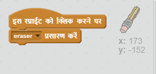

## गलतियाँ करना

कभी-कभी गलती हो जाती है, तो चलिए अपने प्रोजेक्ट में 'साफ़ करें' बटन और रबड़ जोड़ें!

+ 'X-block' स्प्राइट जोड़ें - आप इसे अक्षर अनुभाग के लाइब्रेरी में पाएंगे। पोशाक को लाल में रंगे। यह 'साफ' बटन बन जाएगा।


+ इस स्प्राइट में कोड जोड़ें ताकि जब यह क्लिक किया जाए तो स्टेज साफ हो जाए।


ध्यान दें कि आपको स्टेज को क्लियर करने के लिए संदेश नहीं भेजना होगा, आप इस स्प्राइट से 'साफ़' ब्लॉक का उपयोग कर सकते हैं।

शायद आपने ध्यान दिया होगा कि आपके पेंसिल स्प्राइट में रबड़ पोशाक शामिल है:


+ आपके प्रोजेक्ट में एक अलग से रबड़ स्प्राइट भी शामिल है। Right click on this sprite and choose 'show'. Here is how your stage should look:


+ Add code to the eraser sprite, to tell the pencil to switch to an eraser when the sprite is clicked.



When the pencil receives the "eraser" message, you can switch the pencil costume to the eraser, and switch the pencil colour to white - the same colour as the stage!

+ Add some code to create the eraser

\--- hints \--- \--- hint \--- Add some code to the pencil sprite: **When I receive** the **eraser** message **Switch to costume** eraser **Set pen color** to white \--- /hint \--- \--- hint \--- Here is how the code inside the pencil sprite should look:

```blocks
when I receive [eraser v]
switch costume to [eraser v]
set pen color to [#FFFFFF]
```

\--- /hint \--- \--- /hints \---

+ Test your project, to see if you can clear and erase on the stage.


There's one more problem with the pencil - you can draw anywhere on the stage, including near the selector icons!


To fix this, tell the pencil only to draw if the mouse is clicked *and* if the y-position of the mouse is greater than -120:


+ Test your project; you now shouldn't be able to draw near the selector blocks.

