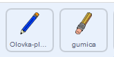
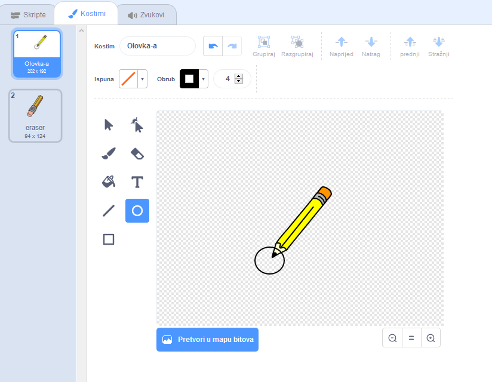

## Napravite olovku

Započnite izradom olovke koju možete koristiti za crtanje na pozornici.

\--- zadatak \--- Otvorite početni projekt Scratch "Paint box".

**Online**: otvorite početni projekt na [rpf.io/paint-box-on](http://rpf.io/paint-box-on){:target="_blank"}

Ako imaš Scratch korisnički račun, možeš napraviti kopiju klikom na **Remix**.

**Offline**: otvorite [starter project](http://rpf.io/p/en/paint-box-go){:target="_blank"} u offline editoru.

Ako trebaš preuzeti i instalirati offline Scratch uređivač, to možeš napraviti na [rpf.io/scratchoff](http://rpf.io/scratchoff){:target="_blank"}

U projektu pokretanja trebali biste vidjeti olovke i gumice za likove:

 \--- /task \---

\--- task \---

Dodajte proširenje olovke svom projektu.

[[[generic-scratch3-add-pen-extension]]]

\--- /task \---

\--- task \---

Add some code to the pencil sprite to make the sprite follow the mouse pointer `forever`{:class="block3control"} so that you can draw:


```blocks3
when flag clicked
forever
  go to (mouse pointer v)
end
```

\--- /task \---

\--- task \--- Click the flag and then move the mouse pointer around the Stage to test whether your code works. \--- /task \---

Next, make your pencil only draw `if`{:class="block3control"} the mouse button is being clicked.

\--- task \--- Add this code to your pencil sprite:


```blocks3
when flag clicked
forever
  go to (mouse pointer v)

+ if <mouse down?> then
  pen down
  else
  pen up
end
```

\--- /task \---

\--- task \--- Test your code again. This time, move the pencil around the Stage and hold down the mouse button. Can you draw with your pencil?

 \--- /task \---

## \--- collapse \---

## title: Does your pencil not draw from its tip?

If the line your pencil draw looks like it is coming from the pencil's middle, you need to change your pencil sprite's so the tip is the sprite's centre.

Click on the pencil sprite, and then click on the **Costumes** tab.

Move the costume's so the tip of the pencil is **just above** the centre.



Now move the pencil around on the Stage and draw. The pencil should now draw a line from its tip.

\--- /collapse \---