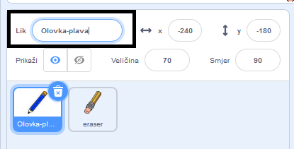
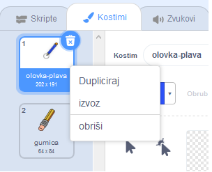
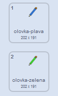
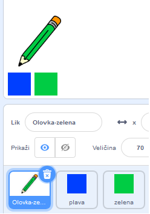

## Bojice

Sada ćete u svoj projekt dodati olovke u različitim bojama i korisniku omogućiti da bira između njih.

\--- task \--- Preimenujte lik `pencil` u `pencil-blue`

 \--- /task \---

\--- task \--- Desnim klikom miša na lik olovke i duplicirajte kostim 'plava olovka'.

 \--- /task \---

\--- task \--- Navedite novi kostim 'olovka-zelena', a olovku obojite zelenom.



\--- /task \---

\--- task \--- Nacrtajte dva nova lika: jedan plavi kvadrat i jedan zeleni kvadrat. Oni su za odabir plave i zelene olovke.

 \--- /task \---

\--- task \--- Preimenujte nove likove tako da se zovu 'plava' i 'zelena'

[[[generic-scratch3-rename-sprite]]]

\--- /task \---

\--- task \--- Dodajte kôd u 'zeleni' lik tako da kad se na ovaj lik klikne, on `broadcasts` {: class = "block3events"} poruku "zelena".


```blocks3
when this sprite clicked
broadcast (green v)
```

[[[generic-scratch3-broadcast-message]]] \--- /task \---

Lik olovke trebao bi slušati poruku "zelene" i u odgovoru mijenjati svoj kostim i boju olovke.

\--- task \--- Prebacite se na svoj lik olovke. Dodajte neki kôd tako da kad ovaj lik primi `green` {: class = "block3events"} emitira se, prelazi u kostim zelene olovke i mijenja boju olovke u zelenu.


```blocks3
when I receive [green v]
switch costume to (pencil-green v)
set pen color to [#00CC44]
```

Da biste olovku postavili u zelenu, kliknite obojeni kvadrat u `set pen color` {: class = "block3extensions"} blok, a zatim kliknite na zeleni kvadrat. \--- /task \---

Zatim napravite sličnu stvar tako da boju olovke možete prebaciti u plavu.

\--- task \--- Kliknite na plavi kvadratni lik i dodajte ovaj kôd:


```blocks3
when this sprite clicked
broadcast (blue v)
```

Zatim kliknite lik olovke i dodajte ovaj kôd: 

```blocks3
when I receive [blue v]
switch costume to (pencil-blue v)
set pen color to [#0000ff]
```

\--- /task \---

\--- task \--- Na kraju dodajte ovaj kôd da biste rekli liku olovke s kojom bojom treba započeti i osigurati da je zaslon čist kada se pokrene vaš program.


```blocks3
when flag clicked
+erase all
+switch costume to (pencil-blue v)
+set pen color to [#0035FF]
forever
  go to (mouse pointer v)
if <mouse down?> then
  pen down
  else
  pen up
end
```

\--- /task \---

Ako želite, možete započeti s olovkom druge boje.

\--- task \--- Test your code. Can you switch between the blue and green pencil colours by clicking on the blue or green square sprites?

 \--- /task \---