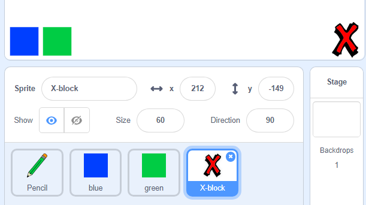

## Poništi pogreške

Ponekad se dogode pogreške, pa dodajte gumb za 'čišćenje' i gumbu za brisanje.

\--- task \--- Dodajte lik 'X-blok' iz odjeljka slova u biblioteci. Oboji kostim lika u crvenu boju i učini ga malo manjim. Ovaj lik je 'čišćenje' gumb.

[[[generic-scratch3-sprite-from-library]]]

 \--- /task \---

\--- task \--- Dodajte kôd u lik "X-blok" da biste očistili pozornicu kad kliknete lik.


```blocks3
when this sprite clicked
erase all
```

\--- /task \---

Ne trebate koristiti `broadcast` {: class = "block3events"} za brisanje pozornice, jer `erase all` {: class = "block3extensions"} blok radi taj posao.

Vidite li da lik olovke uključuje kostim za gumicu?


Vaš projekt uključuje i zasebni lik gumice.

\--- task \--- Desnom tipkom miša kliknite ovaj brisač za brisanje, a zatim kliknite **show**. Evo kako bi sada trebao izgledati vaša pozornica:

 \--- /task \---

\--- task \--- Dodajte kod u lik gumice kako biste poslali `'eraser' broadcast`{: class = "block3events"} kada se klikne lik za brisanje.


```blocks3
when this sprite clicked
broadcast (eraser v)
```

\--- /task \---

Kad lik olovke primi poruku 'gumica', treba svoj kostim prebaciti na gumicu i boju olovke prebaciti na bijelu, koja je iste boje kao i na pozornici!

\--- task \--- Dodajte malo koda za stvaranje gumice.

\--- hints \--- \--- hint \--- Dodajte kod liku olovke: `When I receive`{:class="block3events"} the `eraser`{:class="block3events"} message `Switch to costume eraser`{:class="block3looks"} `Set pen color`{:class="block3extensions"} to white \--- /hint \--- \--- hint \--- Ovo su svi blokovi koje trebate:

```blocks3
set pen color to [#FFFFFF]
when I receive [eraser v]

switch costume to (eraser v)
```

\--- /hint \--- \--- hint \--- Evo kako bi kod trebao izgledati: 

```blocks3
when I receive [eraser v]
switch costume to (eraser v)
set pen color to [#FFFFFF]
```

\--- /hint \--- \--- /hints \--- \--- /task \---

\--- task \--- Testirajte svoj projekt da biste vidjeli možete li očistiti pozornicu i izbrisati linije olovke.

 \--- /task \---

Postoji još jedan problem s olovkom: možete crtati bilo gdje na pozornici, uključujući blizu 'jasnih' gumba i gumica za brisanje!


\--- zadatak \--- Da biste to riješili, promijenite kôd tako da olovka bude spuštena samo ako miš kliknete **and** `y` položaj pokazivača miša veći je od `-120`:


```blocks3
when flag clicked
erase all
switch costume to (pencil-blue v)
set pen color to [#0035FF]
forever
  go to (mouse pointer v)
+if <<mouse down?> and <(mouse y) > [-120]>> then 
  pen down
  else
  pen up
end
```

\--- /task \---

\--- task \--- Testirajte svoj projekt. Sada se ne biste mogli približiti gumbima.

 \--- /task \---