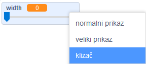

## Promijenite širinu olovke

Zatim ćete dodati kôd kako biste omogućili osobi koja koristi vaš program da crta stvari različite širine olovke.

\--- task \--- Prvo dodajte novu varijablu koja se zove `width`{: Class = "block3variables"}.

[[[generic-scratch3-add-variable]]] \--- /task \---

\--- task \--- Dodajte ovaj redak **inside** u `forever`{: class = "block3control"} petlju koda lika olovke:

```blocks3
when flag clicked
erase all
switch costume to (pencil-blue v)
set pen color to [#0035FF]
forever
go to (mouse pointer v)
+set pen size to (width :: variables)
if <<mouse down?> and <(mouse y) > [-120]>> then 
  pen down
  else
  pen up
end
```

\--- /task \---

Širina olovke sada se kontinuirano postavlja na vrijednost `width`{: class = "block3variables"} varijable.

\--- task \--- Desnom tipkom miša kliknite `width`{: class = "block3variables"} varijabla prikazana na pozornici, a zatim pritisnite **slider**.

 \--- /task \---

Sada možete povući klizač koji je vidljiv ispod varijable da biste promijenili vrijednost varijable.


\--- task \--- Testirajte svoj projekt i provjerite možete li dodati kôd za podešavanje širine olovke.

 \--- /task \---