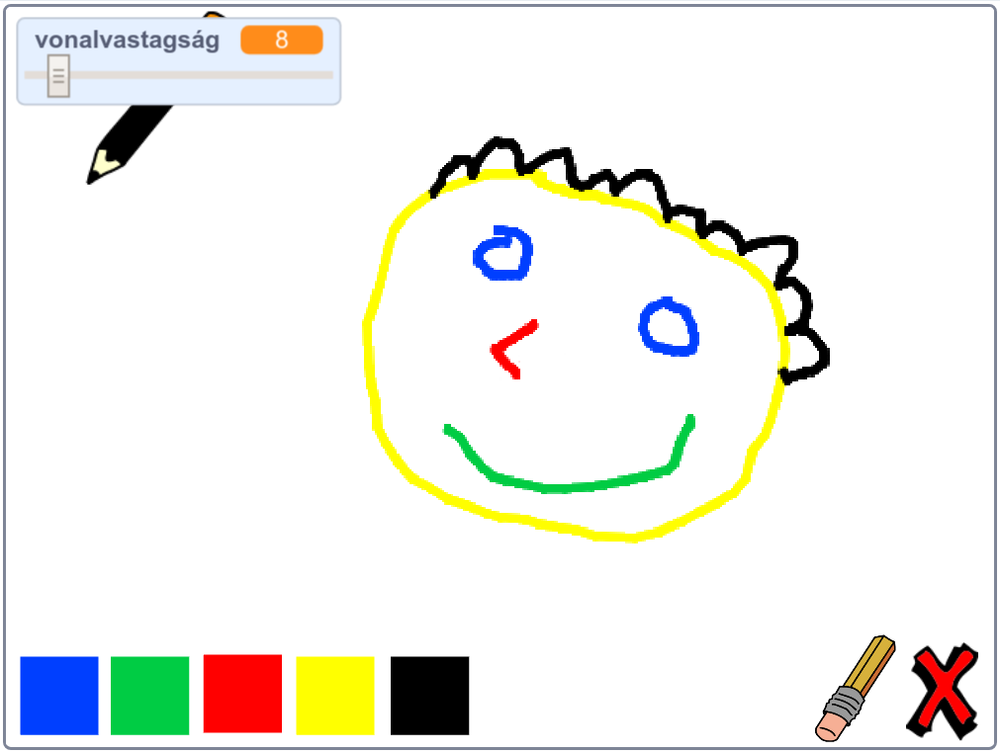

--- no-print ---

Ez a projekt **Scratch 3**-as verziója. A projekt [Scratch 2 változata](https://projects.raspberrypi.org/hu-HU/projects/paint-box-scratch2) is elérhető.

--- /no-print ---

## Bevezetés

Készítsd el a saját rajzoló programod!

### Mit fogsz elkészíteni

--- no-print --- Kattints a zöld zászlóra az program megtekintéséhez. Az egérrel mozgasd a ceruzát és tartsd lenyomva a bal egérgombot. A ceruza színének változtatásához kattints valamelyik színre. Kattints a radírra, hogy törölhesd/javíthasd a rajzod. A rajz teljes törléséhez kattints az X-re.

  <iframe allowtransparency="true" width="485" height="402" src="//scratch.mit.edu/projects/embed/329443797/?autostart=false" frameborder="0" scrolling="no"></iframe>
  

--- /no-print ---

--- print-only --- A zöld zászlóra kattintva indíthatod a programot, az egérrel mozgathatod a ceruzát, és tartsd lenyomva a bal egérgombot a rajzoláshoz. A színekre kattintva megváltozik a ceruza színe, és a radírra kattintva törölhetsz.

 --- /print-only ---

--- collapse ---
---
title: Mit fogsz megtanulni
---

+ hogyan kell hozzáadni a toll kiterjesztést a Scratch-hez
+ hogyan vezérelhetsz szereplőket üzenetküldéssel a Scratch-ben
+ hogyan kell lekezelni az egéreseményeket a Scratch-ben --- / collapse ---

--- collapse ---
---
title: Mire lesz szükséged?
---

### Hardver

+ Egy, a Scratch 3 futtatására alkalmas számítógép

### Szoftver

+ Scratch 3 (vagy [online](http://rpf.io/scratchon){:target="_ blank"} vagy [offline](http://rpf.io/scratchoff){:target="_ blank"})

### Letöltések

+ [Offline kezdőprojekt](http://rpf.io/p/hu-HU/paint-box-go){:target="_blank"}

--- /collapse ---

--- collapse ---
---
title: További információk oktatóknak
---

Ha ki szeretnéd nyomtatni ezt a projektet, kérjük, használd a [nyomtatóbarát verziót](https://projects.raspberrypi.org/hu-HU/projects/paint-box/print) {:target="_blank"}.

You can find the [completed project here](http://rpf.io/p/hu-HU/paint-box-get){:target="_blank"}. --- /collapse ---