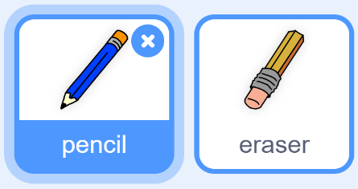
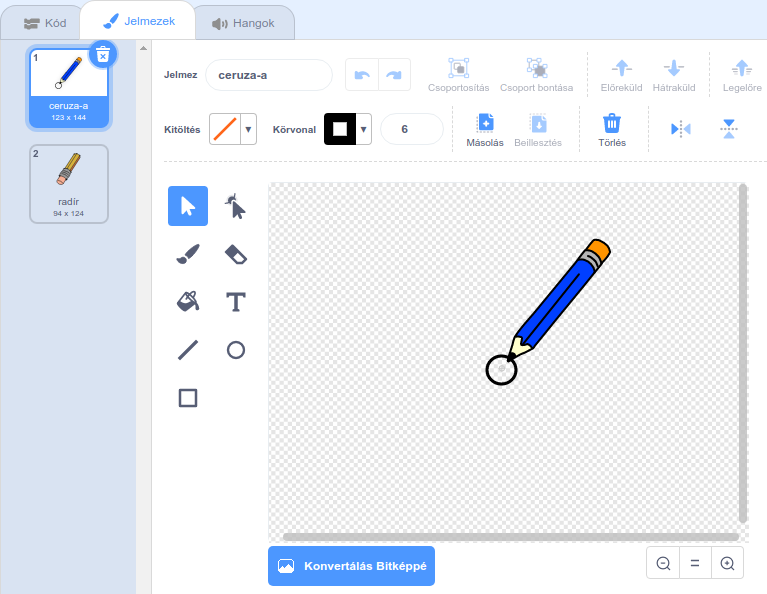

## Készíts egy ceruzát

Készítsünk egy ceruzát, amellyel rajzolhatunk.

--- task --- Nyisd meg a 'Paint box' Scratch kezdő projektet.

**Online:** nyisd meg az kezdő projektet innen: [rpf.io/paint-box-on](http://rpf.io/paint-box-on){:target="_blank"}

Ha van Scratch fiókod, készíthetsz egy másolatot a **@ Remixelés** gombbal.

**Offline**: nyisd meg a [kezdő projektet](http://rpf.io/p/hu-HU/paint-box-go){:target="_blank"} az offline szerkesztőben.

Ha le szeretnéd tölteni és telepíteni a Scratch offline szerkesztőt, akkor azt itt találod: [rpf.io/scratchoff](http://rpf.io/scratchoff){:target="_blank"}

Az kezdő projektben egy ceruzát és egy radírt kell látnod:

 --- /task ---

--- task ---

Add hozzá a Toll bővítményt a projekthez.

[[[generic-scratch3-add-pen-extension]]]

--- /task ---

--- task ---

Adj hozzá néhány kódot a ceruza szereplőhöz úgy, hogy a szereplő `mindig`{:class="block3control"} kövesse az egérmutatót, így tudsz majd rajzolni vele:


```blocks3
⚑ -ra kattintáskor
mindig 
  ugorj (mouse pointer v) helyére
end
```

--- /task ---

--- task --- Kattints a zászlóra, majd mozgasd az egérmutatót a háttér előtt, hogy teszteld a kód működését. --- /task ---

Ezután a ceruza csak akkor rajzoljon, `ha`{: class = "block3control"} az egérgombot lenyomva tartod.

--- task --- Add hozzá ezt a kódot a ceruza szereplőhöz:


```blocks3
⚑ -ra kattintáskor
mindig 
  ugorj (mouse pointer v) helyére
  + ha <mouse down?> akkor 
  +   tollat tedd le
  + különben 
  +   tollat emeld fel
  + end
end
```

--- /task ---

--- task --- Ellenőrizd újra a kódod. Ezúttal mozgasd a ceruzát és tartsd lenyomva az egérgombot. Tudsz rajzolni a ceruzáddal?

 --- /task ---

--- collapse ---
---
title: Nem a ceruza hegyével rajzolsz?
---

Ha a vonalad úgy néz ki, mintha a ceruza közepéről származna, meg kell változtatnod a ceruza szereplőt úgy, hogy a hegye legyen a szereplő középpontja.

Kattints a ceruza szereplőre, majd a **Jelmezek** fülre.

Helyezd át a jelmezt úgy, hogy a ceruza hegye a középpont **felett** legyen.



Most mozgasd a ceruzát és rajzolj. A ceruzának most a hegyéből kell húzni a vonalat.

--- /collapse ---