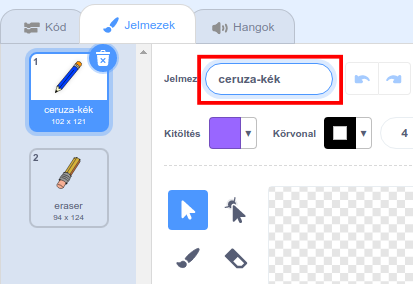
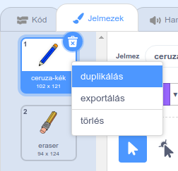
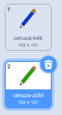
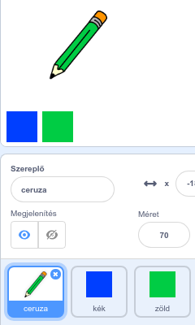

## Színes ceruzák

Most különböző színű ceruzákat fogsz hozzáadni a projekthez, és a felhasználó számára lehetővé teszed, hogy válasszon közülük.

\--- task \--- Nevezd át a `ceruza (pencil)` jelmezt `ceruza-kékre`

 \--- /task \---

\--- task \--- Kattints a jobb gombbal a 'ceruza-kék' jelmezre és duplikáld.

 \--- /task \---

\--- task \--- Nevezd át új jelmezt „ceruza-zöld”-re, és színezze be a zöldre ceruzát.



\--- /task \---

\--- task \--- Rajzolj két új szereplőt: egy kék és egy zöld négyzetet. Ezekkel lehet majd a kék és zöld ceruza között váltani.

 \--- /task \---

\--- task \--- Nevezd át a két új szereplőt „kék”-re és „zöld”-re

[[[generic-scratch3-rename-sprite]]]

\--- /task \---

\--- task \--- Adj a „zöld” szereplőhöz egy olyan kódot, hogy a zöld négyzetre kattintáskor `küldjön`{:class="block3events"} egy "zöld" üzenetet.


```blocks3
ezen szereplőre kattintáskor
küldj üzenetet: (zöld v)
```

[[[generic-scratch3-broadcast-message]]] \--- /task \---

A ceruza szereplőnek hallgatnia kell a "zöld" üzenetre, és válaszul meg kell változnia a jelmezét zöldre.

\--- task \--- Jelöld ki a ceruza szereplőt. Adj hozzá néhány olyan kódblokkot, hogy ha ez a szereplő megkapja a `zöld`{:class="block3events" üzenetet, akkor a váltson a zöld ceruza jelmezre, azaz megváltoztassa a ceruza színét zöldre.


```blocks3
[zöld v] üzenet érkezésekor
jelmez legyen (ceruza-zöld v)
toll színe legyen [#00CC44]
```

A ceruza zöldre váltásához kattints a színes lekerekített négyzetre a `toll színe legyen`{:class= "block3extensions"} blokkban, majd kattints a 'Fényerő' alatti fehért téglalapra, aztán válaszd ki a korábban létrehozott zöld négyzetet a játéktéren. \--- /task \---

Aztán hozz létre egy új kódblokkot ahhoz, hogy a ceruza a színét kékre változtassa.

\--- task \--- Kattints a kék négyzet szereplőre, és add hozzá ezt a kódot:


```blocks3
ezen szereplőre kattintáskor
küldj üzenetet: (kék v)
```

Ezután kattints a ceruza szereplőre, és add hozzá ezt a kódot: 

```blocks3
[kék v] üzenet érkezésekor
jelmez legyen (ceruza-kék v)
toll színe legyen [#0000ff]
```

\--- /task \---

\--- task \--- Végül add hozzá ezt a kódot, ami megmondja a ceruza szereplőnek milyen színű legyen a program indulásakor, illetve törölje a képernyőt induláskor.


```blocks3
⚑ -ra kattintáskor
+töröld a rajzokat
+jelmez legyen (pencil-blue v)
+toll színe legyen [#0035FF]
mindig 
  ugorj (egérmutató v) helyére
  ha <mouse down?> akkor 
    tollat tedd le
  különben 
    tollat emeld fel
  end
end
```

\--- /task \---

Ha gondolod, hozz létre más színű ceruzákat is.

\--- task \--- Ellenőrizd a kódod. Tudsz váltani a kék és a zöld színű ceruza között a kék vagy zöld négyzetre kattintva?

 \--- /task \---