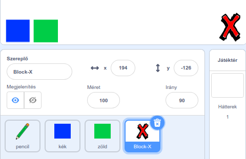

## A hibák visszavonása

Rajzoláskor néha hibákat követünk el, ezért készítsünk egy „törlés” gombot és egy radír gombot is.

--- task --- Add hozzá a 'Block-X' szereplőt a Betűk könyvtárból. Színezd pirosra a jelmezét, és legyen egy kicsit kisebb. Ez lesz a "törlés" gomb.

[[[generic-scratch3-sprite-from-library]]]

 --- /task ---

--- task --- Add hozzá a következő kódot a 'Block-X' szereplőhöz, hogy törölje a játékteret, amikor rákattintasz.


```blocks3
ezen szereplőre kattintáskor
töröld a rajzokat
```

--- /task ---

A játéktér törlésére a `küldj üzenetet`{:class="block3events"} blokk helyett a `töröld a rajzokat`{:class="block3extensions"} blokkot használjuk.

Látod, hogy a ceruza szereplő tartalmaz egy radír (eraser) jelmezt?


A projekt tartalmaz egy különálló radír (eraser) szereplőt is.

--- task --- Kattints a ceruza szereplő radír jelmezére. Most így kell kinéznie a játéktérnek:

 --- /task ---

--- task --- Add hozzá egy olyan kódot a radír szereplőhöz, hogy `küldjön egy 'radír' üzenetet`{:class="block3events"}, ha a radír szereplőre kattintanak.


```blocks3
ezen szereplőre kattintáskor
küldj üzenetet: (radír v)
```

--- /task ---

Amikor a ceruza szereplő megkapja a „radír” üzenetet, át kell változtatnia a jelmezét a radírra, és a színét fehérre, ami ugyanolyan színű, mint a játéktér!

--- task --- Add hozzá néhány kódot a radír funkció elkészítéséhez.

--- hints ---
 --- hint --- Add hozzá ezeket a kódokat a ceruza szereplőhöz: `radír üzenet érkezésekor`{:class="block3events"} `a jelmez legyen`{:class="block3looks"} a radír `a toll színe`{:class="block3extensions"} fehér
--- /hint ---
 --- hint --- Ezekre a kódblokkokra lesz szükséged:

```blocks3
toll színe legyen [#FFFFFF]

[radír v] üzenet érkezésekor

jelmez legyen (radír v)
```

--- /hint --- --- hint --- Így kell kinéznie a kódodnak: 

```blocks3
[radír v] üzenet érkezésekor
jelmez legyen (radír v)
toll színe legyen [#FFFFFF]
```

--- /hint ------ /hints --- --- /task ---

--- task --- Teszteld a projekted, győződj meg arról, hogy tudod törölni a teljes játékteret és működik a radír is.

 --- /task ---

Van még egy probléma a ceruzával: bárhova lehet rajzolni, beleértve a "törlés" és a radírgombokat is!


--- task --- Ennek kijavításához változtasd meg a kódot úgy, hogy a ceruza/radír csak akkor fogjon, ha kattintasz **és** az egérmutató `y` helyzete nagyobb, mint `-120`:


```blocks3
⚑ -ra kattintáskor
töröld a rajzokat
jelmez legyen (ceruza-kék v)
toll színe legyen [#0035FF]
mindig 
  ugorj (egérmutató v) helyére
+ha <<egér lenyomva?> és <(egér y) > [-120]>> akkor 
  tollat tedd le
  különben 
  tollat emeld fel
end
```

--- /task ---

--- task --- Teszteld a projekted. Most már nem tudsz a gombok közelében rajzolni.

 --- /task ---
