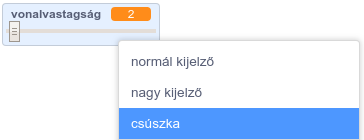
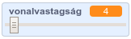

## Módosítsd a vonal vastagságát

Ezúttal hozzáadunk egy kódot, amely lehetővé teszi, hogy a programot használó különböző vastagságú vonalakat rajzoljon.

\--- task \---

First, add a new variable called `width`{:class="block3variables"}.

[[[generic-scratch3-add-variable]]]

\--- /task \---

\--- task \---

Add this line **inside** the `forever`{:class="block3control"} loop of the pencil sprite's code:

```blocks3
⚑ -ra kattintáskor
töröld a rajzokat
jelmez legyen (ceruza-kék v)
toll színe legyen [#0035FF]
mindig 
ugorj (egérmutató v) helyére
+ toll mérete legyen (width :: variables)
ha <<egér lenyomva?> és <(egér y) >[-120]>> akkor 
  tollat tedd le
  különben 
  tollat emeld fel
end
```

\--- /task \---

The pen width now repeatedly gets set to the value of the `width`{:class="block3variables"} variable.

\--- task \---

Right-click on the `width`{:class="block3variables"} variable displayed on the Stage, and then click on **slider**.



\--- /task \---

You can now drag the slider that is visible below the variable to change the variable's value.



\--- task \---

Test your project and see if you can add code to adjust the pen width.


\--- /task \---