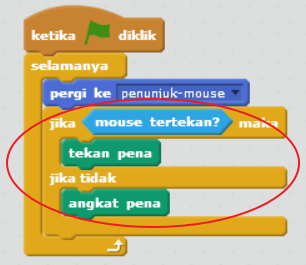

## Membuat pensil

Mari kita mulai dengan membuat pensil yang bisa digunakan untuk menggambar di atas panggung.

+ Buka proyek Scratch 'Paintbox' secara online di [jumpto.cc/paint-go](http://jumpto.cc/paint-go){: target = "_ blank"} atau unduh dari <http://jumpto.cc/paint-get>{: target = "_ blank"} lalu buka jika Anda menggunakan editor luring.

Anda akan melihat sprite pensil dan penghapus:


+ Tambahkan beberapa kode ke sprite pensil untuk membuatnya mengikuti mouse `selamanya`{: class = "blockcontrol"} sehingga Anda dapat menggambar:

```blocks
    ketika flag diklik selamanya pergi ke [mouse pointer v] end
```

+ Klik bendera dan gerakkan mouse di sekitar panggung untuk menguji apakah kode berfungsi.

Selanjutnya, mari kita buat pensil Anda hanya menggambar `jika`{: class = "blockcontrol"} mouse telah diklik.

+ Tambahkan kode ini ke sprite pensil Anda:



+ Uji kode Anda lagi. Kali ini, pindahkan pensil di sekitar panggung dan tahan tombol mouse. Bisakah kamu menggambar dengan pensilmu?


## \--- jatuh \---

## title: Jika Anda mengalami masalah ...

Jika pensil Anda tampaknya menggambar garis dari tengah pensil daripada ujungnya, Anda harus mengubah pusat kostum Anda.


Crosshair untuk pensil harus ditempatkan **tepat di bawah** ujung pensil, bukan di ujung pensil.

Perubahan dalam 'pusat kostum' sprite tidak terdaftar sampai tab lain diklik, jadi klik pada kostum lain, atau pada tab 'Skrip' untuk menyelesaikan perubahan Anda ke pusat kostum.

\--- /jatuh \---