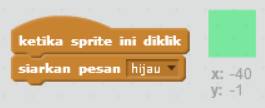
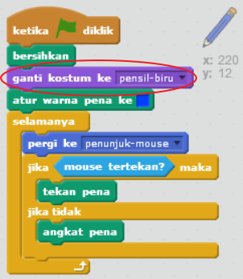

## Pensil warna

Mari tambahkan pensil warna yang berbeda ke proyek Anda, dan izinkan pengguna untuk memilih di antara mereka.

+ Klik sprite pensil Anda, klik 'Kostum' dan gandakan kostum 'pensil biru' Anda.


+ Ubah nama kostum baru Anda 'hijau-pensil', dan warnai pensil hijau.


[[[generic-scratch-rename-sprite]]]

+ Gambar dua sprite baru - satu kotak biru dan satu persegi hijau. Anda akan menggunakan ini untuk memilih pensil biru atau hijau.


+ Ubah nama sprite Anda sehingga mereka disebut 'biru' dan 'hijau'

+ Tambahkan beberapa kode ke sprite 'hijau' sehingga ketika diklik, ia akan `menyiarkan`{: class = "blockevents"} pesan "hijau" ke sprite pensil, memberitahukannya untuk mengubah kostum dan warna pensilnya.



[[[generic-scratch-broadcast-message]]]

+ Beralih ke sprite pensil Anda. Tambahkan beberapa kode sehingga ketika sprite ini menerima `broadcast`{: class = "blockevents"} hijau, itu harus beralih ke kostum pensil hijau dan mengubah warna pena menjadi hijau.


Untuk menyetel pensil menjadi berwarna hijau, klik kotak berwarna di blok `set warna pena`{: class = "blockpen"}, dan klik pada sprite hijau untuk memilih warna hijau yang sama dengan warna pensil Anda.

+ Anda sekarang dapat melakukan hal yang sama untuk ikon pensil biru: tambahkan kode ini ke sprite persegi biru:

```blocks
ketika sprite ini mengklik siaran [blue v]
```

... dan tambahkan kode ini ke sprite pensil:

```blocks
ketika saya menerima kostum [blue v] switch ke [pensil-biru v] tetapkan warna pena ke [# 0000ff]
```

+ Terakhir, tambahkan kode ini untuk memberi tahu sprite pensil yang warnanya dimulai, dan pastikan bahwa layarnya bersih.



Kami memilih untuk memulai dengan warna biru tetapi jika Anda lebih suka, Anda dapat mulai dengan pensil warna yang berbeda.

+ Uji proyek Anda. Dapatkah Anda beralih antara pena biru dan hijau dengan mengklik sprite persegi biru atau hijau?

