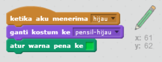

## Pensil berwarna

Mari kita tambahkan pensil berwarna lain ke proyek kamu, dan ijinkan pengguna untuk memilih di antara mereka.

+ Klik sprite pensil kamu, klik 'Kostum' dan gandakan kostum 'pensil biru' kamu.


+ Ganti nama kostum baru menjadi 'hijau-pensil', dan warnai pensil sebagai hijau.


[[[generic-scratch-rename-sprite]]]

+ Gambar dua sprite baru - satu kotak biru dan satu kotak hijau. Kamu akan menggunakan mereka untuk memilih pensil biru atau hijau.


+ Ganti nama sprite kamu sehingga mereka disebut 'biru' dan 'hijau'

+ Tambahkan beberapa kode ke sprite 'hijau' sehingga ketika diklik, pesan "hijau" akan di-`siarkan`{: class = "blockevents"} ke sprite pensil, memberitahu dia untuk mengubah kostum dan warnanya.


[[[generic-scratch-broadcast-message]]]

+ Beralih ke sprite pensil kamu. Tambahkan beberapa kode sehingga ketika sprite ini `menerima`{: class = "blockevents"} pesan "hijau", dia harus beralih ke kostum pensil hijau dan mengubah warna menjadi hijau.



Untuk mengatur pensil ke warna hijau, klik kotak berwarna di blok `atur warna pena`{: class = "blockpen"}, dan klik pada sprite hijau untuk memilih warna hijau yang sama dengan warna pensil kamu.

+ Anda sekarang dapat melakukan hal yang sama untuk ikon pensil biru: tambahkan kode ini ke sprite persegi biru:

```blocks
ketika sprite ini mengklik siaran [blue v]
```

... dan tambahkan kode ini ke sprite pensil:

```blocks
ketika saya menerima kostum [blue v] switch ke [pensil-biru v] tetapkan warna pena ke [# 0000ff]
```

+ Terakhir, tambahkan kode ini untuk memberi tahu sprite pensil yang warnanya dimulai, dan pastikan bahwa layarnya bersih.


Kami memilih untuk memulai dengan warna biru tetapi jika Anda lebih suka, Anda dapat mulai dengan pensil warna yang berbeda.

+ Uji proyek Anda. Dapatkah Anda beralih antara pena biru dan hijau dengan mengklik sprite persegi biru atau hijau?

