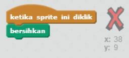
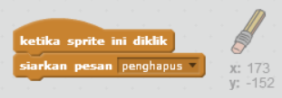
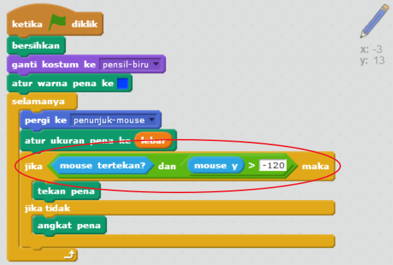

## Membuat kesalahan

Terkadang kesalahan terjadi, jadi mari kita tambahkan tombol 'bersihkan' dan penghapus.

+ Tambahkan sprite 'X-block' - kamu akan menemukannya di pustaka, pada bagian huruf. Warnai kostum dengan warna merah. Ini akan menjadi tombol 'bersihkan'.


+ Tambahkan kode ke sprite ini untuk membersihkan stage saat diklik.



Perhatikan bahwa Anda tidak perlu mengirim pesan untuk membersihkan panggung, Anda bisa menggunakan blok bersih dari sprite ini.

Anda mungkin memperhatikan bahwa sprite pensil Anda termasuk kostum penghapus:


+ Proyek Anda juga mencakup sprite penghapus terpisah. Klik kanan pada sprite ini dan pilih 'show'. Beginilah tampilan panggung Anda:


+ Tambahkan kode ke sprite penghapus, untuk memberi tahu pensil untuk beralih ke penghapus saat sprite diklik.



Ketika pensil menerima pesan "penghapus", Anda dapat mengalihkan kostum pensil ke penghapus, dan mengganti warna pensil menjadi putih - warna yang sama dengan panggung!

+ Tambahkan beberapa kode untuk membuat penghapus

\--- petunjuk \--- \--- petunjuk \--- Tambahkan beberapa kode ke sprite pensil: **Ketika saya menerima** **penghapus** pesan **Beralih ke kostum** penghapus **Set warna pena** hingga putih \--- / petunjuk \--- \--- petunjuk \--- Di sini adalah bagaimana kode di dalam sprite pensil harus terlihat:

```blocks
ketika saya menerima kostum [penghapus v] untuk [penghapus v] set warna pena ke [#FFFFFF]
```

\--- / petunjuk \--- \--- / petunjuk \---

+ Uji proyek Anda, untuk melihat apakah Anda dapat menghapus dan menghapus di atas panggung.


Ada satu lagi masalah dengan pensil - Anda dapat menggambar di mana saja di atas panggung, termasuk di dekat ikon pemilih!


Untuk memperbaikinya, beri tahu pensil hanya untuk menggambar jika mouse diklik *dan* jika posisi-y mouse lebih besar dari -120:



+ Uji proyek Anda; Anda sekarang seharusnya tidak dapat mendekati blok pemilih.

