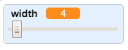
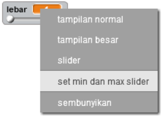

## Mengubah lebar pensil

Mari kita ijinkan pengguna untuk menggambar dengan beragam ukuran pensil yang berbeda.

+ Pertama, tambahkan variabel baru bernama `lebar`{:class="blockvariable"}.

[[[generic-scratch-add-variable]]]

+ Tambahkan baris ini *di dalam* pengulangan `selamanya`{:class="blockcontrol"} pada kode pensil:

```blocks
    mengatur ukuran pena ke (lebar)
```

Lebar pensil sekarang akan berulang kali diatur ke nilai variabel 'lebar'.

+ Klik kanan pada tampilan variabel di atas panggung dan klik 'slider'.


Anda sekarang dapat menyeret penggeser di bawah variabel untuk mengubah nilainya.



+ Uji proyek Anda, dan lihat apakah Anda dapat memodifikasi lebar pensil.


Jika Anda suka, Anda dapat mengatur nilai minimum dan maksimum 'lebar' yang diizinkan. Untuk melakukan ini, klik kanan pada variabel lagi dan klik 'set slider min dan max'. Tetapkan nilai minimum dan maksimum dari variabel Anda ke sesuatu yang lebih masuk akal, seperti 1 dan 20.



Terus uji variabel 'lebar' Anda sampai Anda puas.