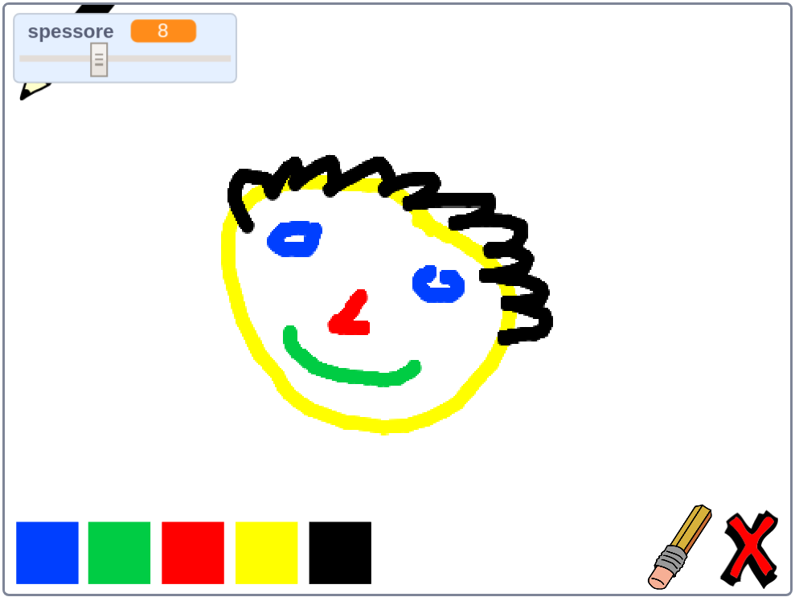

--- no-print ---

Questa è la versione **Scratch 3** del progetto. C'è anche una versione [Scratch 2 del progetto](https://projects.raspberrypi.org/it-IT/projects/paint-box-scratch2).

--- /no-print ---

## Introduzione

Crea un programma per disegnare!

### Cosa creerai

--- no-print ---

Clicca sulla bandiera verde per cominciare. Utilizza il mouse per muovere la matita, e tieni premuto il pulsante sinistro per disegnare. Clicca su un colore per cambiare le matite. Clicca sulla gomma per usarla e cancellare il tuo lavoro. Per cancellare tutto, clicca sulla x.

  <iframe allowtransparency="true" width="485" height="402" src="//scratch.mit.edu/projects/embed/329442160/?autostart=false" frameborder="0" scrolling="no"></iframe>
  

--- /no-print ---

--- print-only ---

Fai clic sulla bandierina verde per iniziare. Utilizzerai il mouse per spostare la matita e, tenendo premuto il tasto sinistro, disegnerai. Cliccando su un colore cambierai il colore della matita e cliccando sulla gomma la potrai utilizzare!

--- /print-only ---

--- collapse ---
---
title: Cosa imparerai
---
+ Aggiungi l'estensione penna in Scratch
+ Usa l'invio di messaggi per controllare uno sprite in Scratch
+ Ricorda come rispondere agli eventi del mouse in Scratch

--- /collapse ---

--- collapse ---
---
title: Di cosa avrai bisogno
---
### Hardware

+ Un computer in grado di eseguire Scratch 3

### Software

+ Scratch 3 ([online](https://rpf.io/scratchon){:target="_blank"} o [offline](https://rpf.io/scratchoff){:target="_blank"}"})

### Download

+ [Progetto di partenza offline](https://rpf.io/p/it-IT/paint-box-go){:target="_blank"}

--- /collapse ---

--- collapse ---
---
title: Informazioni aggiuntive per gli educatori
---
Se intendete stampare questo progetto, cliccate su [Versione stampabile](https://projects.raspberrypi.org/it-IT/projects/paint-box/print){:target="_blank"}.

Puoi trovare il [progetto completo qui](https://rpf.io/p/it-IT/paint-box-get){:target="_blank"}.

--- /collapse ---