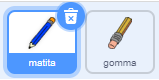
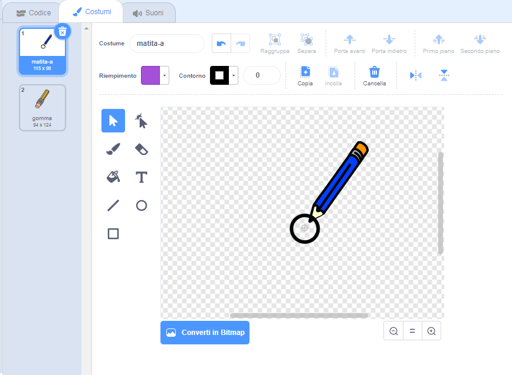

## Di cosa avrai bisogno

Inizia creando una matita che può essere usata per disegnare sul quadro.

\--- task \--- Aprire il progetto di avvio Scratch 'Paint box'.

**Online**: apri il progetto di avvio su [rpf.io/paint-box-on](http://rpf.io/paint-box-on){: target = "_ blank"}

Se hai un account Scratch puoi fare una copia cliccando su **Remix**.

**Offline**: apre il progetto [starter](http://rpf.io/p/en/paint-box-go){: target = "_ blank"} nell'editor offline.

Se hai bisogno di scaricare ed installare l'editor Scratch offline, puoi trovarlo su [rpf.io/scratchoff](http://rpf.io/scratchoff){:target="_blank"}

Nel progetto iniziale, dovresti vedere sprite di gomma e matita:

 \--- /task \---

\--- task \---

Aggiungi l'estensione penna al tuo progetto.

[[[generic-scratch3-add-pen-extension]]]

\--- /task \---

\--- task \---

Aggiungi del codice allo sprite matita per far sì che lo sprite segua il puntatore del mouse `per sempre`{: class = "block3control"} in modo da poter disegnare:


```blocks3
when flag clicked
forever
  go to (mouse pointer v)
end
```

\--- /task \---

\--- Fai click sulla bandierina e muovi il mouse sul quadro per verificare che il codice funzioni. \--- /task \---

Ora facciamo in modo che la matita disegni solo `se`{:class="blockcontrol"} il mouse è stato cliccato.

\--- task \--- Aggiungi questo codice al tuo sprite matita:


```blocks3
when flag clicked
forever
  go to (mouse pointer v)

+ if <mouse down?> then
  pen down
  else
  pen up
end
```

\--- /task \---

\--- task \--- Testare nuovamente il codice. Questa volta, muovi la matita sul quadro e tieni premuto il tasto sinistro del mouse. Riesci a disegnare con la tua matita?

 \--- /task \---

## \--- collapse \---

## titolo: la tua matita non scrive dalla sua punta?

Se la linea che disegna la tua matita sembra provenire dal centro di essa, devi cambiare lo sprite in modo che la punta sia il il suo centro.

Fai clic sullo sprite matita e poi sulla scheda **Costumi**.

Sposta il costume in modo che la punta della matita sia ** appena sopra ** il centro.



Ora sposta la matita sul quadro e disegna. La matita dovrebbe ora tracciare una linea dalla sua punta.

\--- / chiudi \---