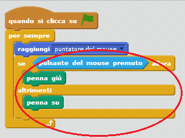

## Creare una matita

Iniziamo a creare una matita che può essere usata per disegnare sul quadro.

+ Apri il progetto Scratch online 'Scatola dei Colori' a <a href="http://jumpto.cc/paint-go" target="_blank">jumpto.cc/paint-go</a> o scaricalo da <a href="http://jumpto.cc/paint-get" target="_blank">jumpto.cc/paint-get</a> e poi aprilo se stai usando l'editore offline.

	Vedrai gli sprite della matita e della gomma:

	

+ Siccome userai il mouse per disegnare, vorrai che la matita segua il mouse `per sempre`{:class="blockcontrol"}. Aggiungi questo codice allo sprite della tua matita:

	```blocks
		quando si clicca sulla bandiera verde
		per sempre
  			raggiungi [mouse pointer v]
		end
	```

+ Prova questo codice cliccando la bandiera e muovendo poi il mouse attorno al quadro.

+ Poi, facciamo in modo che la tua matita disegni `se`{:class="blockcontrol"} il mouse è stato cliccato. Aggiungi questo codice allo sprite della tua matita:

	

+ Prova di nuovo il codice. Questa volta, muovi la matita attorno al quadro e tieni premuto il tasto del mouse. Puoi disegnare con la matita?

	


