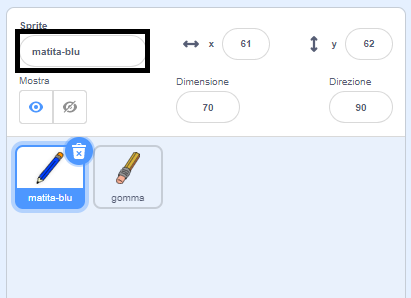
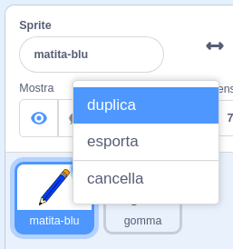
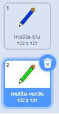
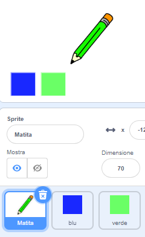

## Matite colorate

Ora aggiungerai al tuo progetto matite di diversi colori e consentirai all'utente di sceglierne una.

--- task --- Rinomina lo sprite `matita` in `matita-blu`

 --- /task ---

--- task --- Fai clic con il tasto destro del mouse sullo sprite della matita e duplica il costume "matita-blu".

 --- /task ---

--- task --- Riomina il nuovo costume 'matita-verde' e colora la matita di verde.



--- /task ---

--- task --- Disegna due nuovi sprite: un quadrato blu e un quadrato verde. Questi sono per scegliere tra la matita blu e verde.

 --- /task ---

--- task --- Rinominare i nuovi sprite in modo che si chiamino 'blu' e 'verde'

[[[generic-scratch3-rename-sprite]]]

--- /task ---

--- task --- Aggiungi un po' di codice allo sprite "verde" in modo che, quando questo sprite viene cliccato, `invii il messaggio`{:class="block3events"} "verde".


```blocks3
quando si clicca questo sprite
invia a tutti (verde v)
```

[[[generic-scratch3-broadcast-message]]] --- /task ---

Lo sprite della matita dovrebbe sentire il messaggio "verde" e cambiare il proprio costume e colore in risposta.

--- task --- Passa al tuo sprite matita. Aggiungi del codice in modo che, quando questo sprite riceve il messaggio `verde`{:class="block3events"}, passi al costume della matita verde e cambi il colore della penna in verde.


```blocks3
when I receive [verde v]
switch costume to (pencil-green v)
set pen color to [#00CC44]
```

Per impostare la matita da colorare in verde, fai clic sul quadratino colorato nel blocco `porta colore penna a`{: class = "block3extensions"}, quindi fai clic sullo sprite quadrato verde. --- /task ---

Quindi procedi in modo simile per cambiare il colore della matita in blu.

--- task --- Clicca sullo sprite quadrato blu e aggiungi questo codice:


```blocks3
quando si clicca questo sprite
invia a tutti (blu v)
```

Quindi fare clic sullo sprite matita e aggiungere questo codice: 

```blocks3
quando ricevo [blu v]
passa al costume (matita-blu v)
porta colore penna a [#0000ff]
```

--- /task ---

--- task --- Infine, aggiungi questo codice per dire allo sprite della matita con quale colore iniziare e per assicurarti che lo schermo sia pulito all'avvio del programma.


```blocks3
quando si clicca sulla bandiera verde
+ pulisci
+ passa al costume (matita-blu v)
+ porta colore penna a [#0035FF]
per sempre 
  raggiungi (puntatore del mouse v)
  se <mouse down?> allora 
    penna giù
  altrimenti 
    penna su
  end
end
```

--- /task ---

Se preferisci, puoi iniziare con una matita di colore diverso.

--- task --- Verifica il tuo codice. Riesci a cambiare colore alla matita facendo clic sugli sprite quadrato blu o verde?

 --- /task ---