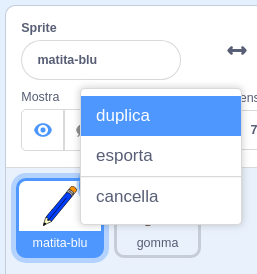

## Matite colorate

Aggiungiamo delle matite colorate al tuo progetto, e permettiamo all’utente di scegliere quella che preferisce.

+ Clicca sullo sprite della matita, clicca ‘Costumi’ e duplica il costume ‘matita-blu’.



+ Rinomina il tuo nuovo costume ‘matita-verde’, e colora la matita di verde.


[[[generic-scratch-rename-sprite]]]

+ Crea due nuovi sprite: un quadrato blu e un quadrato verde. Userai questi sprite per selezionare la matita blu o quella verde.


+ Rinomina i tuoi sprite 'blu' e 'verde'

+ Aggiungi dei codici allo sprite 'verde' per far sì che quando vi si clicca sopra `invii a tutti`{:class="blockevents"} il messaggio "verde", comunicando così allo sprite della matita di cambiare costume e colore.


[[[generic-scratch-broadcast-message]]]

+ Cambia sprite. Aggiungi dei codici per fare in modo che quando lo sprite riceve il messaggio `invia a tutti`{:class="blockevents"} "verde", il costume della matita e quello della penna diventino verdi.


Per fare in modo che quando disegni la linea sia verde, clicca la casella colorata nel blocco `imposta colore`, e clicca sull’icona verde per scegliere il verde come colore della matita.

+ You can now do the same for the blue pencil icon: add this code to the blue square sprite:

```blocks
when this sprite clicked
broadcast [blue v]
```

...and add this code to the pencil sprite:

```blocks
when I receive [blue v]
switch costume to [pencil-blue v]
set pen color to [#0000ff]
```

+ Finally, add this code to tell the pencil sprite which colour to start with, and make sure that the screen is clear.


We chose to start with blue but if you prefer, you can start with a different colour pencil.

+ Test out your project. Can you switch between blue and green pens by clicking on the blue or green square sprites?

