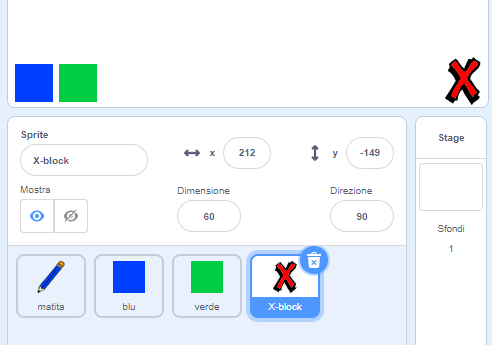
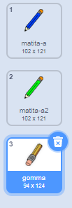

## Fare errori

A volte si può sbagliare, dunque aggiungiamo al tuo progetto il tasto 'ripulisci' e una gomma!

+ Aggiungiamo un tasto per ripulire il quadro. Per fare ciò, aggiungi al quadro lo sprite della lettera 'X-block' e coloralo in rosso.

	

+ Aggiungi il codice al tuo nuovo tasto cancella per ripulire il quadro quando viene cliccato.

	```blocks
		quando si clicca questo sprite
		pulisci
	```

	Nota che non è necessario mandare un messaggio per ripulire il quadro, perché può farlo qualsiasi sprite!

+ Avrai probabilmente notato che lo sprite della matita include un costume da gomma:

	


+ Il tuo progetto include anche uno sprite per selezionare la gomma, cliccalo col tasto destro e scegli 'mostra'. Il tuo quadro dovrebbe essere così:

	

+ Ora puoi aggiunger un codice allo sprite selezionatore della gomma, per comunicare alla matita di diventare gomma.

	```blocks
		quando si clicca questo sprite
		invia a tutti [gomma v]
	```

+ Quando la matita riceve questo messaggio, puoi creare una gomma passando dall'costume matita a quello di gomma, e cambiando il colore della matita con lo stesso colore del quadro!

	```blocks
		quando ricevo [gomma v]
		passa al costume [gomma v]
		usa penna di colore [#FFFFFF]
	```

+ Prova il tuo progetto per vedere se puoi cancellare sul quadro.

	

+ C'è un altro problema con la matita - puoi disegnare dappertutto sul quadro, anche vicino alle icone selezionatrici!

	

	Per risolverlo, devi comunicare alla matita di disegnare solo se il mouse è cliccato_e_se la posizione y del mouse è maggiore di -120 (`mouse y`{:class="blocksensing"}`> -120`{:class="blockoperators}). Cambia l'affermazione `se`{:class="blockcontrol"} della matita per farla diventare così:

	

+ Prova il tuo progetto; ora dovresti essere in grado di disegnare vicino ai blocchi selettori.

	


