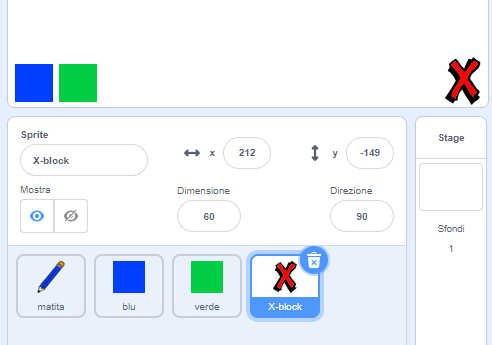
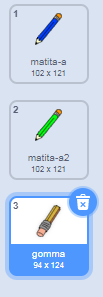

## Fare errori

A volte capita di sbagliare, quindi aggiungi un pulsante "pulisci tutto" e un pulsante gomma.

\--- task \---

Aggiungi lo sprite 'X-block' dalla sezione delle lettere della libreria. Colora il costume dello sprite in rosso e rimpiccioliscilo un po'. Questo sprite è il pulsante "pulisci tutto".

[[[generic-scratch3-sprite-from-library]]]



\--- /task \---

\--- task \---

Aggiungi il codice allo sprite 'X-block' per cancellare completamente lo stage quando lo si clicca.


```blocks3
quando si clicca questo sprite
pulisci
```

\--- /task \---

Non è necessario `inviare un messaggio`{:class="block3events"} per cancellare lo stage, perché il comando `pulisci`{:class="block3extensions"} svolge già questa funzione.

Hai visto che lo sprite matita include un costume "gomma"?



Il tuo progetto include anche uno sprite per selezionare la gomma.

\--- task \---

Click on this eraser sprite and then select **show**.


Here is how your Stage should look now:


\--- /task \---

\--- task \---

Add code to the eraser sprite to send an `'eraser' broadcast`{:class="block3events"} when the eraser sprite is clicked.


```blocks3
quando si clicca questo sprite
invia a tutti (gomma v)
```

\--- /task \---

When the pencil sprite receives the 'eraser' message, it should switch its costume to the eraser and switch the pen colour to white, which is the same colour as the Stage!

\--- task \---

Add some code to create the eraser.

\--- hints \--- \--- hint \---

Add some code to the pencil sprite: `When I receive`{:class="block3events"} the `eraser`{:class="block3events"} message `Switch to costume eraser`{:class="block3looks"} `Set pen color`{:class="block3extensions"} to white

\--- /hint \--- \--- hint \---

Here are all the blocks you need:

```blocks3
porta colore penna a [#FFFFFF]

quando ricevo [gomma v]

passa al costume (gomma v)
```

\--- /hint \--- \--- hint \---

Here is what the code should look like:


```blocks3
quando ricevo [eraser v]
passa costume a (gomma v)
imposta colore penna a [#FFFFFF]
```

\--- /hint \--- \--- /hints \--- \--- /task \---

\--- task \---

Test your project to see if you can clear the Stage and erase pencil lines.


\--- /task \---

There's one more problem with the pencil: you can draw anywhere on the Stage, including near the 'clear' and eraser buttons!


\--- task \---

To fix this, change the code so that the pen is only down if the mouse is clicked **and** the `y` position of the mouse pointer is greater than `-120`:


```blocks3
quando si clicca sulla bandiera verde
pulisci
passa al costume (matita-blu v)
porta colore penna a [#0035FF]
per sempre 
  raggiungi (puntatore del mouse v)
  + se <<mouse down?> e <(y del mouse) > [-120]>> allora 
  +   penna giù
  + altrimenti 
  +   penna su
  + end
end
```

\--- /task \---

\--- task \---

Test your project. You now should not be able to draw near the buttons.


\--- /task \---