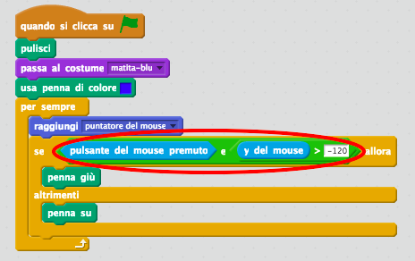

## Fare errori

A volte si può sbagliare, dunque aggiungiamo al tuo progetto il tasto ‘ripulisci’ e una gomma.

+ Aggiungi al quadro lo sprite della lettera ‘X-block’. Lo trovi nella libreria, nella sezione "Lettere". Colora il costume di rosso. Ecco il tuo tasto 'ripulisci'.


+ Aggiungi un codice al tuo nuovo tasto 'ripulisci' per ripulire il quadro quando viene cliccato.


Noterai che non è necessario mandare un messaggio per ripulire il quadro, perché puoi farlo da qualsiasi sprite!

Avrai probabilmente notato che lo sprite della matita include un costume da gomma:


+ Il tuo progetto include anche uno sprite per selezionare la gomma. Right click on this sprite and choose 'show'. Here is how your stage should look:


+ Add code to the eraser sprite, to tell the pencil to switch to an eraser when the sprite is clicked.


When the pencil receives the "eraser" message, you can switch the pencil costume to the eraser, and switch the pencil colour to white - the same colour as the stage!

+ Add some code to create the eraser

\--- hints \--- \--- hint \--- Add some code to the pencil sprite: **When I receive** the **eraser** message **Switch to costume** eraser **Set pen color** to white \--- /hint \--- \--- hint \--- Here is how the code inside the pencil sprite should look:

```blocks
when I receive [eraser v]
switch costume to [eraser v]
set pen color to [#FFFFFF]
```

\--- /hint \--- \--- /hints \---

+ Test your project, to see if you can clear and erase on the stage.


There's one more problem with the pencil - you can draw anywhere on the stage, including near the selector icons!


To fix this, tell the pencil only to draw if the mouse is clicked *and* if the y-position of the mouse is greater than -120:



+ Test your project; you now shouldn't be able to draw near the selector blocks.

