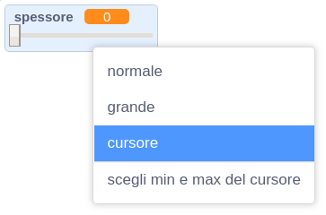
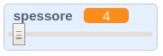

## Cambiare la larghezza della matita

Facciamo in modo che l'utente possa disegnare usando una varietà di misure di matita diverse.

+ Per prima cosa, aggiungiamo una nuova variabile chiamata 'larghezza'. Se non sai come si fa, il progetto 'Ghostbusters' ti sarà utile.

+ Aggiungi questa linea_dentro_il loop `per sempre` {.blockcontrol} del codice della matita:

	```blocks
		usa penna di dimensione (larghezza)
	```

	La larghezza della matita ora verrà costantemente regolata al valore della tua variabile 'larghezza'.

+ Puoi cambiare il numero conservato in questa variabile facendo clic col pulsante destro sulla tua variabile (sul quadro) e cliccando la barra di regolazione (SLIDER in inglese).

	

	Puoi ora trascinare lo slider sotto la variabile per cambiarne il valore.

	

+ Prova il tuo progetto e vedi se riesci a modificare la larghezza della matita.

	

	Se preferisci, puoi impostare il valore massimo e minimo permesso per la 'larghezza'. Per fare ciò, clicca di nuovo col pulsante destro sulla tua variabile e clicca 'imposta slider minimo e massimo'. Regola il valore minimo e massimo della tua variabile per qualcosa di più sensibile, come 1 e 20.

	

	Continua a provare la tua variabile 'larghezza' fino a raggiungere il valore desiderato.


