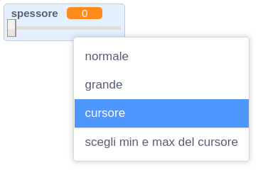
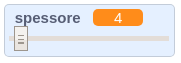

## Cambiare lo spessore della penna

Ora aggiungerai il codice per consentire all'utente del tuo programma di disegnare usando diversi spessori di penna.

\--- task \---

First, add a new variable called `width`{:class="block3variables"}.

[[[generic-scratch3-add-variable]]]

\--- /task \---

\--- task \---

Add this line **inside** the `forever`{:class="block3control"} loop of the pencil sprite's code:

```blocks3
quando si clicca sulla bandiera verde
pulisci
passa al costume (matita-blu v)
porta colore penna a [#0035FF]
per sempre 
  raggiungi (puntatore del mouse v)
  + porta dimensione penna a (spessore :: variables)
  se <<mouse down?> e <(y del mouse) > [-120]>> allora 
    penna giù
  altrimenti 
    penna su
  end
end
```

\--- /task \---

The pen width now repeatedly gets set to the value of the `width`{:class="block3variables"} variable.

\--- task \---

Right-click on the `width`{:class="block3variables"} variable displayed on the Stage, and then click on **slider**.



\--- /task \---

You can now drag the slider that is visible below the variable to change the variable's value.



\--- task \---

Test your project and see if you can add code to adjust the pen width.


\--- /task \---