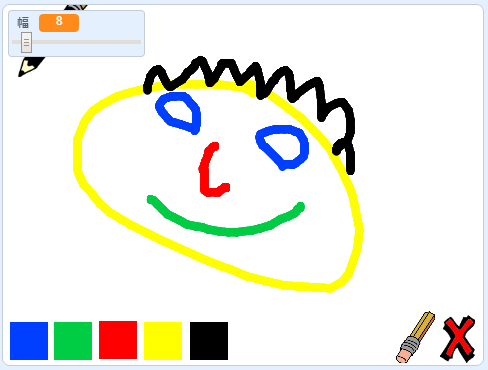

## はじめに

Make your own paint program!

### 作るもの

\--- no-print \---

Click on the green flag to start. Use the mouse to move the pencil, and hold down the left mouse button to draw. Click on a colour to change pencils. Click on the eraser to change to it, and use it to erase your work. To clear the page, click on the cross.

  <iframe allowtransparency="true" width="485" height="402" src="//scratch.mit.edu/projects/embed/267243161/?autostart=false" frameborder="0" scrolling="no"></iframe>
  

\--- /no-print \---

\--- print-only \---

You will click on the green flag to start, and you'll use the mouse to move the pencil and hold down the left mouse button to draw. Clicking on a colour will change pencil colours, and clicking on the eraser will change to the eraser!

\--- /print-only \---

## \--- collapse \---

## title: 学習すること

+ Scratchのペン拡張機能を追加する
+ Scratchのメッセージを使ってスプライトを制御する
+ Scratchのマウスイベントに反応する方法を思い出す

\--- /collapse \---

## \--- collapse \---

## title: 必要なもの

### ハードウェア

+ Scratch 3を実行できるコンピュータ

### ソフトウェア

+ Scratch 3 (either [online](https://rpf.io/scratchon){:target="_blank"} or [offline](https://rpf.io/scratchoff){:target="_blank"})

### ダウンロード

+ [Offline starter project](https://rpf.io/p/en/paint-box-go){:target="_blank"}

\--- /collapse \---

## \--- collapse \---

## title：教育者向けの追加情報

If you need to print this project, please use the [printer-friendly version](https://projects.raspberrypi.org/en/projects/paint-box/print){:target="_blank"}.

You can find the [completed project here](https://rpf.io/p/en/paint-box-get){:target="_blank"}.

\--- /collapse \---