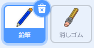

## 鉛筆を作る

まず、ステージでお絵かきをする鉛筆を作ります。

\--- task \---

「ペイントボックス」というScratchのスタータープロジェクトを開きます。

**Online**: open the starter project at [rpf.io/paint-box-on](https://rpf.io/paint-box-on){:target="_blank"}

Scratchアカウントをお持ちの場合は、 **リミックス**ボタンをクリックしてコピーできます。

**Offline**: open the [starter project](https://rpf.io/p/en/paint-box-go){:target="_blank"} in the offline editor.

If you need to download and install the Scratch offline editor, you can find it at [rpf.io/scratchoff](https://rpf.io/scratchoff){:target="_blank"}

スタータープロジェクトには鉛筆と消しゴムのスプライトが含まれています。



\--- /task \---

\--- task \---

プロジェクトにペン拡張機能を追加します。

[[[generic-scratch3-add-pen-extension]]]

\--- /task \---

\--- task \---

鉛筆スプライトにコードを追加して、スプライトがマウスポインタ―に`ずっと`{:class="blockcontrol"}ついていって絵が描けるようにします。


```blocks3
⚑ が押されたとき
ずっと 
  (マウスのポインター v) へ行く
end
```

\--- /task \---

\--- task \---

旗をクリックし、ステージの中でマウスをぐるぐる動かして、コードがうまく動くかテストしてみましょう。

\--- /task \---

次に、`もし`{:class="block3control"}マウスが押されていれば、その時だけ鉛筆で線を描くようにしてみましょう。

\--- task \---

鉛筆スプライトにこのコードを足しましょう。


```blocks3
⚑ が押されたとき
ずっと 
  (マウスのポインター v) へ行く

+  もし <mouse down?> なら 
    ペンを下ろす
  でなければ 
    ペンを上げる
  end
end
```

\--- /task \---

\--- task \---

もう一度テストしてみましょう。 今度は、マウスを押しながら鉛筆をステージの中で動かします。 うまく絵がかけましたか？


\--- /task \---

## \--- collapse \---

## title: 鉛筆の先端から線が描けていませんか？

鉛筆が描く線が鉛筆の真ん中から来ているように見える場合は、先端がスプライトの中心になるように鉛筆のスプライトを変更する必要があります。

鉛筆のスプライトをクリックしてから、**コスチューム**タブをクリックします。

鉛筆の先端が中心の**ちょっと上**になるようにコスチュームを移動します。


次に、ステージで鉛筆を動かして描いてみます。 鉛筆はその先端から線を描くはずです。

\--- /collapse \---