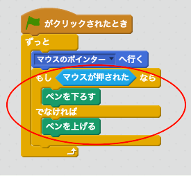
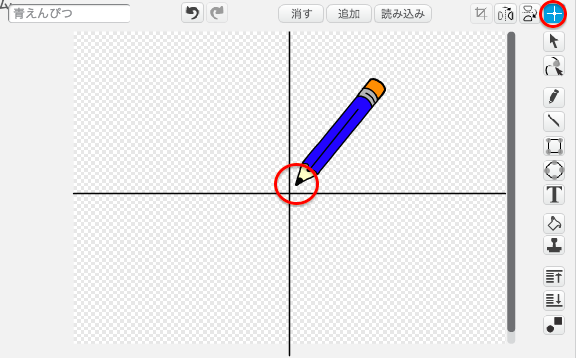

## えんぴつを作る

まず、ステージでお絵かきをするえんぴつを作ります。

+ 「お絵かきの箱」という名前のスクラッチ・プロジェクトを開きます。オンラインで開く場合はこちら[jumpto.cc/paint-go](http://jumpto.cc/paint-go){:target="_blank"} から、オフラインエディターを使う場合はこちら<http://jumpto.cc/paint-get>{:target="_blank"}からダウンロードして、プロジェクトを開きます。

えんぴつと消しゴムのスプライトが出てきます。


+ えんぴつスプライトにコードを追加して、マウスに`ずっと`{:class="blockcontrol"}ついていって絵が描けるようにします。

```blocks
    ⚑がクリックされた時
　ずっと
　　マウスポインターへ行く
```

+ フラグ⚑ボタンをクリックして、ステージの中でマウスをぐるぐる動かしてみましょう。

次に、`もし`{:class="blockcontrol"}マウスが押された状態であればえんぴつで線を書けるようにしてみましょう。

+ えんぴつスプライトにこのコードを足しましょう。



+ もう一度テストしてみましょう。 今度は、マウスを押しながらえんぴつをステージの中で動かします。 うまく絵がかけましたか？


## \--- collapse \---

## title: 問題がある場合...

If your pencil seems to be drawing the line from the middle of the pencil rather than the tip, you will need to change your costume center.



The crosshair for the pencil must be placed **just below** the tip of the pencil, not on the tip of the pencil.

A changes in a sprite's 'costume center' isn't registered until another tab is clicked, so click on another costume, or on the 'Scripts' tab to finalise your changes to the costume center.

\--- /collapse \---