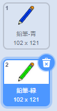

## 色鉛筆

次にプロジェクトに異なる色の鉛筆を加えて、ユーザーがそれらの中から選ぶことができるようにしましょう。

--- task ---

`鉛筆`スプライトの名前を`鉛筆-青`に変更します


--- /task ---

--- task ---

鉛筆スプライトを右クリックして、「鉛筆-青」コスチュームを複製します。


--- /task ---

--- task ---

新しいコスチュームに「鉛筆-緑」と名前を付け、鉛筆の色を緑にします。



--- /task ---

--- task ---

青い四角と緑の四角の、2つの新しいスプライトを描きます。 これらは青または緑の鉛筆を選ぶのに使います。


--- /task ---

--- task ---

新しいスプライトの名前を変更して、「青」と「緑」と呼ぶようにします

[[[generic-scratch3-rename-sprite]]]

--- /task ---

--- task ---

「緑」のスプライトにコードを追加して、スプライトがクリックされたら「緑」というメッセージを`送る`{:class="block3events"}ようにします。


```blocks3
when this sprite clicked
broadcast (緑 v)
```

[[[generic-scratch3-broadcast-message]]]

--- /task ---

鉛筆スプライトが「緑」のメッセージを受け取ったら、コスチュームと鉛筆の色を変える必要があります。

--- task ---

鉛筆スプライトに切り替えます。 コードを追加して、このスプライトが`緑`{:class="block3events"}のメッセージを受け取ったときに、コスチュームを緑色の鉛筆に切り替えて、ペンの色を緑に変更するようにします。


```blocks3
when I receive [緑 v]
switch costume to (鉛筆-緑 v)
set pen color to [#00CC44]
```

鉛筆の色を緑に設定するには、`ペンの色を～にする`{:class="block3extensions"}ブロック内の色のついた四角をクリックし、そして緑色の四角のスプライトをクリックします。

--- /task ---

次に、同じように鉛筆の色を青に切り替えます。

--- task ---

青い四角のスプライトをクリックしてこのコードを追加します。


```blocks3
when this sprite clicked
broadcast (青 v)
```

そして、鉛筆のスプライトをクリックしてこのコードを追加します。


```blocks3
when I receive [青 v]
switch costume to (鉛筆-青 v)
set pen color to [#0000ff]
```

--- /task ---

--- task ---

最後にこのコードを追加して、鉛筆のスプライトをどの色から始めるか決めて、プログラムの開始時に画面をクリアするようにします。


```blocks3
when flag clicked
+erase all
+switch costume to (鉛筆-青 v)
+set pen color to [#0035FF]
forever
  go to (マウスのポインター v)
if <mouse down?> then
  pen down
  else
  pen up
end
```

--- /task ---

もしそうしたければ、別の色の鉛筆から始めることもできます。

--- task ---

コードをテストしましょう。 青または緑の四角のスプライトをクリックして、鉛筆の色を青と緑に切り替えることはできますか？


--- /task ---