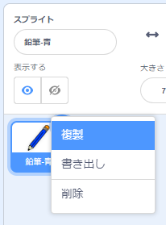
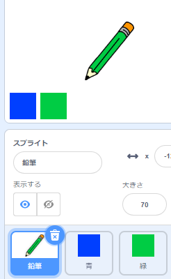

## 色鉛筆

今度はあなたのプロジェクトに異なった色鉛筆を加え、ユーザーがそれらの間で選ぶことを可能にすることになっています。

\--- task \--- 鉛筆のスプライトをクリックし、 **Costumes**クリックして、 'pencil-blue'の衣装を複製します

 \--- /task \---

\--- task \--- 新しい衣装に 'pencil-green'という名前を付け、鉛筆に緑色の色を付けます。


\--- /task \---

\--- task \--- 2つの新しいスプライトを描きます。1つは青い正方形、もう1つは緑色の正方形です。 これらは青と緑の鉛筆の間で選択するためのものです。

 \--- /task \---

\--- task \--- 新しいスプライトの名前を 'blue'と 'green'に変更します。

[[[generic-scratch3-rename-sprite]]]

\--- /task \---

\---タスク\--- 「グリーン」スプライトにいくつかのコードを追加するように、このスプライトは、クリックされたとき、それは `ブロードキャスト`{：クラス=「block3events」}メッセージ「グリーン」。


```blocks3
このスプライトが
ブロードキャストをクリックしたとき（緑色のv）
```

[[[generic-scratch3-broadcast-message]]] \--- / task \---

鉛筆のスプライトは「緑色」のメッセージを聞き取り、それに応じて衣装と鉛筆の色を変更する必要があります。

\--- task \--- 鉛筆のスプライトに切り替えます。 このスプライトが `green`{：class = "block3events"}ブロードキャストを受信したときに緑色の鉛筆コスチュームに切り替えて、ペンの色を緑色に変更するようにコードを追加します。


```blocks3
[green v]を受け取ったとき
衣装を（pencil-green v）
ペン色を[＃00CC44]に設定
```

鉛筆を緑色に設定するには、 `set pen color`{：class = "block3extensions"}ブロック内の色付きの四角形をクリックしてから、緑色の四角形のスプライトをクリックします。 \--- /task \---

あなたは鉛筆の色を青に切り替えることができるようにそれから同様のことに。

\--- task \--- 青い四角のスプライトをクリックして次のコードを追加：


```blocks3
このスプライトが
ブロードキャストをクリックしたとき（青v）
```

次に、鉛筆のスプライトをクリックして、次のコードを追加してください 

```blocks3
[blue v]を受け取ったとき
衣装を（pencil-blue v）
ペン色を[＃0000ff]に設定
```

\--- /task \---

\--- task \--- 最後に、このコードを追加して、どの色から始めるかを鉛筆のスプライトに指示し、プログラムの起動時に画面が明確になるようにします。


```blocks3
フラグがクリックされたときに
+全消去
+は、（鉛筆ブルーV）に衣装を切り替え
+設定ペンの色[＃0035FF]に
永久
  （マウスポインタV）に移動
であれば <mouse down?> その後
  ペンダウン
  そう
  ペンアップ
終了
```

\--- /task \---

あなたが好めば、あなたは別の色鉛筆から始めることができます。

\--- task \--- コードをテストしてください。 青または緑の正方形のスプライトをクリックして、青と緑の鉛筆色を切り替えることができますか。

 \--- /task \---