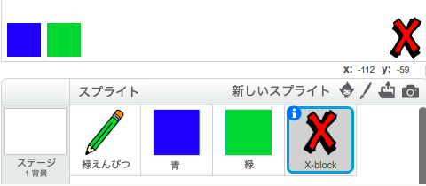
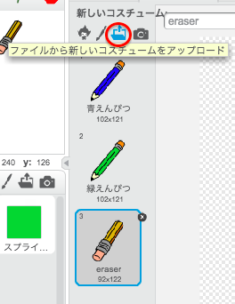

## 間違いを元に戻す

時々起きる間違いのために、「クリア」ボタンと消しゴムボタンを追加します。

--- task ---

ライブラリの文字セクションから「Block-X」スプライトを追加します。 スプライトのコスチュームを赤で着色し、少し小さくします。 このスプライトが「クリア」ボタンです。

[[[generic-scratch3-sprite-from-library]]]



--- /task ---

--- task ---

「Block-X」スプライトにコードを追加して、スプライトがクリックされたときにステージをクリアします。


```blocks3
when this sprite clicked
erase all
```

--- /task ---

ステージをクリアするのに`メッセージを送る`{:class="block3events"}を使用する必要はありません。なぜなら、`全部消す`{:class="block3extensions"}ブロックで事が済むするからです。

鉛筆のスプライトに消しゴムのコスチュームが含まれているのが分かりますか？



プロジェクトには別に消しゴムのスプライトも含まれています。

--- task ---

消しゴムのスプライトを右クリックしてから**表示**をクリックします。 ステージはこのようになります。


--- /task ---

--- task ---

コードを消しゴムスプライトに追加して、クリックされたときに`「消しゴム」メッセージを送る`{:class="block3events"}ようにします。


```blocks3
when this sprite clicked
broadcast (消しゴム v)
```

--- /task ---

鉛筆のスプライトが「消しゴム」メッセージを受け取ると、コスチュームを消しゴムに切り替え、ペンの色をステージと同じ色の白に切り替える必要があります！

--- task ---

コードを追加して消しゴムを作ります。

--- hints ---
 --- hint ---

鉛筆のスプライトにコードを追加します。 `消しゴム`{:class="block3events"}メッセージ`を受け取ったとき`{:class="block3events"} `コスチュームを消しゴムにする`{:class="block3looks"} `ペンの色を`{:class="block3extensions"}を白にする

--- /hint --- --- hint ---

必要なブロックは次のとおりです。

```blocks3
set pen color to [#FFFFFF]
when I receive [消しゴム v]

switch costume to (消しゴム v)
```

--- /hint --- --- hint ---

コードは次のようになります。


```blocks3
when I receive [消しゴム v]
switch costume to (消しゴム v)
set pen color to [#FFFFFF]
```

--- /hint ------ /hints --- --- /task ---

--- task ---

ステージをクリアして鉛筆の線を消すことができるかどうか、プロジェクトをテストします。


--- /task ---

鉛筆にはもう1つ問題があります。ステージ上のどこにでも、「クリア」ボタンや消しゴムボタンの近くにも描くことができます！


--- task ---

この問題を解決するには、マウスがクリックされて、**そして**マウスポインタ―の`y`座標が`120`より大きいときだけペンを下ろすようにコードを変更します。


```blocks3
when flag clicked
erase all
switch costume to (鉛筆-青 v)
set pen color to [#0035FF]
forever
  go to (マウスのポインター v)
+if <<マウスがおされた> and <(マウスのyざひょう) > [-120]>> then
  pen down
  else
  pen up
end
```

--- /task ---

--- task ---

プロジェクトをテストします。 ボタンの近くには描くことができないはずです。


--- /task ---