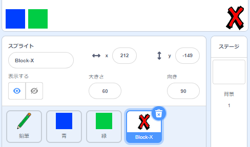
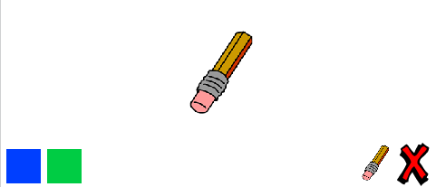

## 間違いを元に戻す

時々間違いが起こるので、「クリア」ボタンと消しゴムボタンを追加します。

\--- task \--- ライブラリのlettersセクションから 'X-block'スプライトを追加してください。 スプライトのコスチュームを赤で着色して少し小さくします。 このスプライトは「クリア」ボタンです。

[[[generic-scratch3-sprite-from-library]]]

 \--- /task \---

\--- task \--- スプライトがクリックされたときにステージをクリアするために 'X-block'スプライトにコードを追加します。


```blocks3
このスプライトが
クリックしたときすべて消去
```

\--- /task \---

ステージ `をクリアするのに <code>broadcast`{：class = "block3events"}を使用する必要はありません。なぜなら` erase all`{：class = "block3extensions"}ブロックがその仕事をするからです。

あなたは鉛筆のスプライトが消しゴムの衣装を含んでいるのを見ますか？


あなたのプロジェクトには独立した消しゴムスプライトも含まれています。

\--- task \--- この消しゴムスプライトを右クリックしてから **show**クリックします。 これがステージの外観です。

 \--- /task \---

\--- task \--- 消しゴムスプライトをクリックしたときに `'消しゴム'ブロードキャスト`{：class = "block3events"}を送信するためのコードを消しゴムスプライトに追加します。


```blocks3
このスプライトが
ブロードキャストをクリックしたとき（消しゴムv）
```

\--- /task \---

鉛筆のスプライトが「消しゴム」メッセージを受け取ると、そのコスチュームを消しゴムに切り替え、ペンの色を白（ステージと同じ色）に切り替える必要があります。

\--- task \--- 消しゴムを作成するためのコードを追加します。

\---ヒント\--- \---ヒント\--- 鉛筆のスプライトにコードを追加します ``{：class = "block3events"} `消しゴム`{：class = "block3events"} message `コスチューム消しゴムに切り替えます`{：class = "block3looks"} `ペンの色`{：class = "block3extensions"}を白に設定します \--- /ヒント\--- \---ヒント\--- これがあなたが必要とするすべてのブロックです：

```blocks3
[消しゴムv]

を受け取ったらペン色を[#FFFFFF]
に設定
```

\--- / hint \--- \--- hint \--- これがコードの外観です 

```blocks3
[消しゴムv]を受け取ったら
衣装を（消しゴムv）
切り替える
```

\--- / hint \--- \--- / hints \--- \--- / task \---

\--- task \--- プロジェクトをテストして、ステージをクリアして鉛筆の線を消去できるかどうかを確認します。

 \--- /task \---

鉛筆にはもう1つ問題があります。「クリア」ボタンや消しゴムボタンの近くなど、ステージ上のどこにでも描画できます。


\---タスク\--- この問題を解決するには、マウスがクリックされた場合、ペンだけダウンするようにコードを変更する **及び** `、Y` 、マウスポインタの位置がより大きく `-120`：


```blocks3
フラグをクリック
消去を全て
（鉛筆ブルーV）に切り替え衣装
[＃0035FF]に設定されたペンの色
永久
  （マウスポインタV）に移動
+なら <<mouse down?> および <（マウスY） > [-120]>> その後 
  ペンダウンして
  それ以外
  ペンアップして
終わり
```

\--- /task \---

\--- task \--- プロジェクトをテストしてください。 今すぐボタンの近くに描画することができないはずです。

 \--- /task \---