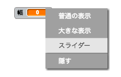

## ペン幅を変える

次に、コードを追加して、このプログラムを使用する人がそれぞれのペン幅で描画できるようにします。

\--- task \---

First, add a new variable called `width`{:class="block3variables"}.

[[[generic-scratch3-add-variable]]]

\--- /task \---

\--- task \---

Add this line **inside** the `forever`{:class="block3control"} loop of the pencil sprite's code:

```blocks3
⚑ が押されたとき
全部消す
コスチュームを (鉛筆-青 v) にする
ペンの色を [#0035FF] にする
ずっと 
  (マウスのポインター v) へ行く
  +ペンの太さを (幅:: variables) にする
  もし <<mouse down?> かつ <(マウスのy座標) > [-120]>> なら 
    ペンを下ろす
  でなければ 
    ペンを上げる
  end
end
```

\--- /task \---

The pen width now repeatedly gets set to the value of the `width`{:class="block3variables"} variable.

\--- task \---

Right-click on the `width`{:class="block3variables"} variable displayed on the Stage, and then click on **slider**.



\--- /task \---

You can now drag the slider that is visible below the variable to change the variable's value.


\--- task \---

Test your project and see if you can add code to adjust the pen width.


\--- /task \---