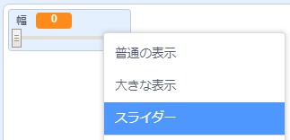
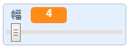

## ペン幅を変える

次に、コードを追加して、このプログラムを使用する人がそれぞれのペン幅で描画できるようにします。

--- task ---

まず最初に、`幅`{:class="block3variables"}という新しい変数を追加します。

[[[generic-scratch3-add-variable]]]

--- /task ---

--- task ---

鉛筆スプライトコードの`ずっと`{:class="block3control"}ループの**内部に**この行を追加します。

```blocks3
when flag clicked
erase all
switch costume to (鉛筆-青 v)
set pen color to [#0035FF]
forever
go to (マウスのポインター v)
+set pen size to (幅 :: variables)
if <<mouse down?> and <(マウスのyざひょう) > [-120]>> then
  pen down
  else
  pen up
end
```

--- /task ---

ペンの幅は`幅`{:class="block3variables"}変数の値に繰り返し設定されます。

--- task ---

ステージに表示された`幅`{:class="block3variables"}変数を右クリックし、**スライダー**をクリックします。



--- /task ---

変数の下に表示されているスライダーをドラッグして変数の値を変更できます。



--- task ---

プロジェクトをテストして、ペン幅を調整するコードを追加できたかどうか確認します。


--- /task ---