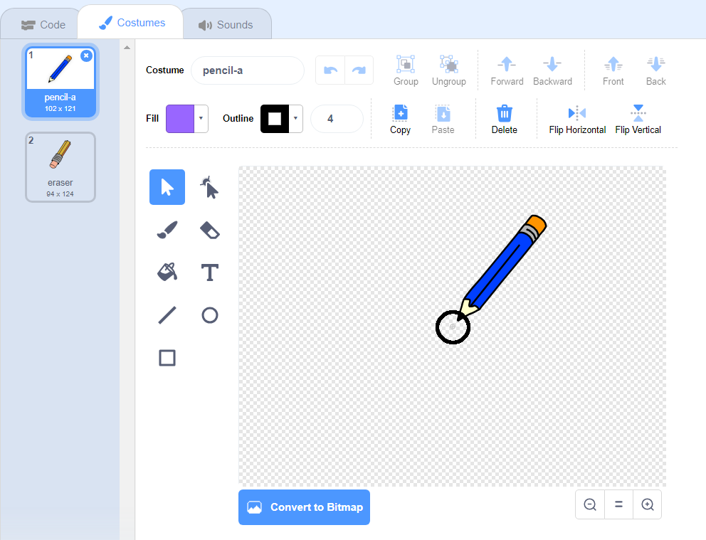

## ಸೀಸಕಡ್ಡಿಅನ್ನು ತಯಾರಿಸಿ

ವೇದಿಕೆಯಲ್ಲಿ ಸೆಳೆಯಲು ನೀವು ಬಳಸಬಹುದಾದ ಸೀಸಕಡ್ಡಿ ತಯಾರಿಸುವ ಮೂಲಕ ಪ್ರಾರಂಭಿಸಿ.

\--- task \---

'ಬಣ್ಣದ ಪೆಟ್ಟಿಗೆ' Scratch starter ಯೋಜನೆಯನ್ನು ತೆರೆಯಿರಿ.

**Online**:[rpf.io/paint-box-on](http://rpf.io/paint-box-on){:target="_blank"} ನಲ್ಲಿ ಸ್ಟಾರ್ಟರ್ ಯೋಜನೆಯನ್ನು ತೆರೆಯಿರಿ

ನೀವು Scratch ಖಾತೆಯನ್ನು ಹೊಂದಿದ್ದರೆ ನೀವು **Remix** ಕ್ಲಿಕ್ ಮಾಡುವ ಮೂಲಕ ನಕಲನ್ನು ಮಾಡಬಹುದು.

**Offline**: [ಸ್ಟಾರ್ಟರ್ ಯೋಜನೆಯನ್ನು](http://rpf.io/p/en/paint-box-go){:target="_blank"} ಆಫ್‌ಲೈನ್ ಸಂಪಾದಕದಲ್ಲಿ ತೆರೆಯಿರಿ.

ನೀವು Scratch ಆಫ್‌ಲೈನ್ ಸಂಪಾದಕವನ್ನು ಡೌನ್‌ಲೋಡ್ ಮಾಡಿ ಸ್ಥಾಪಿಸಬೇಕಾದರೆ, ನೀವು ಅದನ್ನು [rpf.io/scratchoff](http://rpf.io/scratchoff){:target="_blank"} ನಲ್ಲಿ ಕಾಣಬಹುದು

Scratch ಯೋಜನೆಯಲ್ಲಿ, ನೀವು ಸೀಸಕಡ್ಡಿ ಮತ್ತು eraser ಸ್ಪ್ರೈಟ್‌ಗಳನ್ನು ನೋಡಬೇಕು:


\--- /task \---

\--- task \---

ನಿಮ್ಮ ಯೋಜನೆಗೆ ಲೇಖನಿ ವಿಸ್ತರಣೆಯನ್ನು ಸೇರಿಸಿ.

[[[generic-scratch3-add-pen-extension]]]

\--- /task \---

\--- task \---

ಸ್ಪ್ರೈಟ್ ಮೌಸ್ ಪಾಯಿಂಟರ್ `forever`{:class="block3control"} ಅನ್ನು ಅನುಸರಿಸುವಂತೆ ಮಾಡಲು ಸೀಸಕಡ್ಡಿ ಸ್ಪ್ರೈಟ್‌ಗೆ ಕೆಲವು ಕೋಡ್ ಸೇರಿಸಿ ಇದರಿಂದ ನೀವು ಸೆಳೆಯಬಹುದು:


```blocks3
when flag clicked
forever
  go to (mouse pointer v)
end
```

\--- /task \---

\--- task \---

ನಿಮ್ಮ ಕೋಡ್ ಕಾರ್ಯನಿರ್ವಹಿಸುತ್ತದೆಯೇ ಎಂದು ಪರೀಕ್ಷಿಸಲು ಧ್ವಜವನ್ನು ಕ್ಲಿಕ್ ಮಾಡಿ ಮತ್ತು ನಂತರ ಮೌಸ್ ಪಾಯಿಂಟರ್ ಅನ್ನು ಹಂತದ ಸುತ್ತಲೂ ಸರಿಸಿ.

\--- /task \---

ಮುಂದೆ, ಮೌಸ್ ಗುಂಡಿಯನ್ನು ಕ್ಲಿಕ್ ಮಾಡುತ್ತಿದ್ದರೆ ನಿಮ್ಮ ಸೀಸಕಡ್ಡಿ ಅನ್ನು `if`{:class="block3control"} ಮಾತ್ರ ಸೆಳೆಯುವಂತೆ ಮಾಡಿ.

\--- task \---

ನಿಮ್ಮ ಸೀಸಕಡ್ಡಿ ಸ್ಪ್ರೈಟ್‌ಗೆ ಈ ಕೋಡ್ ಸೇರಿಸಿ:


```blocks3
when flag clicked
forever
  go to (mouse pointer v)

+ if <mouse down?> then
  pen down
  else
  pen up
end
```

\--- /task \---

\--- task \---

ನಿಮ್ಮ ಕೋಡ್ ಅನ್ನು ಮತ್ತೆ ಪರೀಕ್ಷಿಸಿ. ಈ ಸಮಯದಲ್ಲಿ, ಸೀಸಕಡ್ಡಿ ಅನ್ನು ಹಂತದ ಸುತ್ತಲೂ ಸರಿಸಿ ಮತ್ತು ಮೌಸ್ ಗುಂಡಿಯನ್ನು ಒತ್ತಿಹಿಡಿಯಿರಿ. ನಿಮ್ಮ ಸೀಸಕಡ್ಡಿನೊಂದಿಗೆ ನೀವು ಸೆಳೆಯಬಹುದೇ?


\--- /task \---

## \--- collapse \---

## title: ನಿಮ್ಮ ಸೀಸಕಡ್ಡಿ ಅದರ ತುದಿಯಿಂದ ಸೆಳೆಯುವುದಿಲ್ಲವೇ?

ನಿಮ್ಮ ಸೀಸಕಡ್ಡಿಯ ರೇಖೆಯು ಅದರ ಮಧ್ಯದಿಂದ ಬರುತ್ತಿರುವಂತೆ ತೋರುತ್ತಿದ್ದರೆ, ನಿಮ್ಮ ಪೆನ್ಸಿಲ್ ಸ್ಪ್ರೈಟ್ ಅನ್ನು ನೀವು ಬದಲಾಯಿಸಬೇಕಾಗಿದೆ ಆದ್ದರಿಂದ ತುದಿ ಸ್ಪ್ರೈಟ್‌ನ ಕೇಂದ್ರವಾಗಿದೆ.

ಪೆನ್ಸಿಲ್ ಸ್ಪ್ರೈಟ್ ಮೇಲೆ ಕ್ಲಿಕ್ ಮಾಡಿ, ತದನಂತರ **Costumes** ಟ್ಯಾಬ್ ಕ್ಲಿಕ್ ಮಾಡಿ.

ವೇಷಭೂಷಣವನ್ನು ಸರಿಸಿ ಆದ್ದರಿಂದ ಪೆನ್ಸಿಲ್‌ನ ತುದಿ ಮಧ್ಯದ **just above** ಇರುತ್ತದೆ.



ಈಗ ವೇದಿಕೆಯಲ್ಲಿ ಸೀಸಕಡ್ಡಿ ಅನ್ನು ಸರಿಸಿ ಮತ್ತು ಎಳೆಯಿರಿ. ಸೀಸಕಡ್ಡಿ ಈಗ ಅದರ ತುದಿಯಿಂದ ಒಂದು ರೇಖೆಯನ್ನು ಸೆಳೆಯಬೇಕು.

\--- /collapse \---