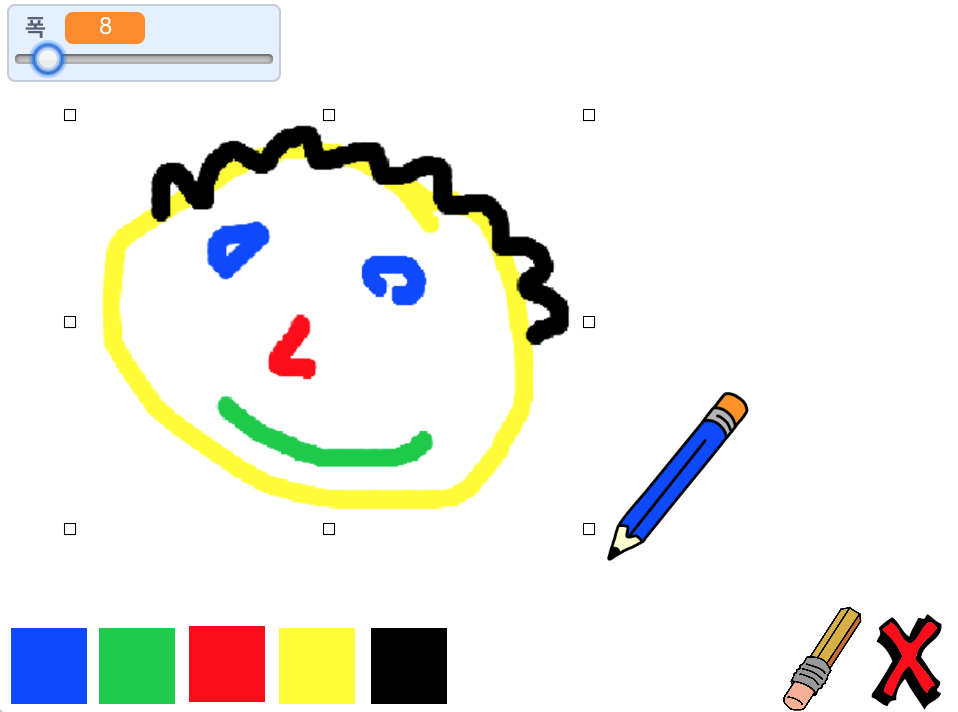

--- no-print ---

이 프로젝트의 **스크래치 3** 버전입니다. [프로젝트의 스크래치 2 버전](https://projects.raspberrypi.org/ko-KR/projects/paint-box-scratch2)도 있습니다.

--- /no-print ---

## 들어가며

자신만의 색칠하기 프로그램을 만들어봐요!

### 만들게 될 것

--- no-print --- 녹색 깃발을 클릭하여 시작하세요. 마우스를 사용하여 연필을 이동하고 마우스 왼쪽 버튼을 누른 상태로 그립니다. 색상을 클릭하여 연필을 변경하세요. 지우개를 클릭하여 자신의 그림을 변경하거나 제거하는데 사용할 수 있습니다. 페이지를 지우려면 X표시를 클릭 해 보세요.

  <iframe allowtransparency="true" width="485" height="402" src="//scratch.mit.edu/projects/embed/331746350/?autostart=false" frameborder="0" scrolling="no"></iframe>
  

--- /no-print ---

--- 인쇄 전용 --- 시작하려면 녹색 깃발을 클릭하고, 마우스를 사용하여 연필을 이동하고 마우스 왼쪽 버튼을 누른 상태로 그립니다. 색상을 클릭하면 연필 색상이 변경되고 지우개를 클릭하면 지우개로 변경됩니다!

 --- /print-only ---

--- collapse ---
---
title: 배우게 될 것
---

+ 스크래치에 펜 확장 추가
+ 브로드 캐스트를 사용하여 스크래치에서 스프라이트 제어하기
+ Scratch 에서 마우스 이벤트에 응답하는 방법을 생각해 내기 --- / collapse ---

--- 중간생략 ---
---
title: 준비물
---
### 하드웨어

+ 스크래치 3을 실행할 수 있는 컴퓨터

### 소프트웨어

+ 스크래치 3 ( [온라인](http://rpf.io/scratchon){:target="_blank"} 또는 [offline](http://rpf.io/scratchoff){:target="_blank"})

### 다운로드

+ [오프라인 스타터 프로젝트](http://rpf.io/p/ko-KR/paint-box-go){:target="_blank"}

-- /collapse ---

--- collapse ---
---
title: 교육자를 위한 추가 정보
---

이 프로젝트를 인쇄한다면 [프린트용 버전](https://projects.raspberrypi.org/ko-KR/projects/paint-box/print){:target="_blank"}을 사용해 주십시오.

여기서 [완료된 프로젝트를 확인할 수 있습니다](http://rpf.io/p/ko-KR/paint-box-get){:target="_blank"}. --- /collapse ---