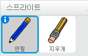
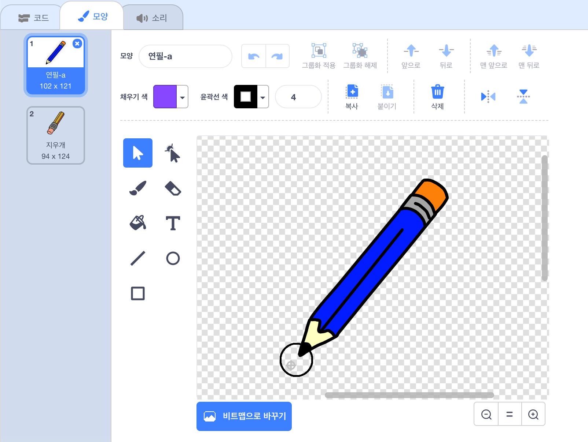

## 준비물

무대에 그림을 그리는 데 사용되는 연필을 만드는 것으로 시작해 봅시다.

--- task --- 파이썬 스타터 프로젝트를 엽니다.

**온라인:** [rpf.io/paint-box-on](https://rpf.io/paint-box-on){:target="_blank"}에서 새로운 스타터 프로젝트 열기.

스크래치 계정이있는 경우 **Remix를 클릭** 하여 사본을 만들 수 있습니다.

**오프라인**: [스타터 프로젝트](https://rpf.io/p/ko-KR/paint-box-go){:target="_blank"} 를 오프라인 에디터에서 여세요.

스크래치 오프라인 에디터를 다운로드 받아야 하는 경우, [rpf.io/scratchoff](https://rpf.io/scratchoff) 에서 다운 받을 수 있습니다.

스타터 프로젝트에서는 연필과 지우개 스프라이트가 있습니다.

 --- /task ---

--- task ---

프로젝트에 펜 확장 프로그램을 추가합니다.

[[[generic-scratch3-add-pen-extension]]]

--- /task ---

--- task ---

연필이 마우스에 따라 움직이도록 `무한반복하기` 에 코드를 추가해 봅시다.


```blocks3
⚑ 클릭했을 때
무한 반복하기 
  (마우스 포인터 v) \(으\)로 이동하기
end
```

--- /task ---

--- task --- 깃발을 클릭 후 마우스를 움직여서 코드가 원하는데로 동작하는지 테스트 해 봅시다. --- /task ---

다음으로, `만약`{:class="blockcontrol"} 마우스 버튼이 클릭됐을때만 그림을 그리도록 만들어 봅시다.

--- task --- 연필 스프라이트에 이 코드를 추가해 주세요:


```blocks3
⚑ 클릭했을 때
무한 반복하기 
  (마우스 포인터 v) \(으\)로 이동하기
+ 만약 <마우스를 클릭했는가?> \(이\)라면 
  펜 내리기
  아니면 
  펜 올리기
  end
end
```

--- /task ---

--- task --- 코드를 다시 테스트 해 보세요. 이번엔, 마우스 버튼을 누른 상태에서 연필을 이동해 보세요. 연필로 그림을 그릴 수 있나요?

 --- /task ---

--- collapse ---
---
title: 연필의 끝이 닿는 지점에 선이 그려지나요?
---
연필의 가운데에서 선이 그려지는 것처럼 보인다면 연필 스프라이트를 변경하여 연필심이 스프라이트 중심에 오도록 해야 합니다.

연필 스프라이트를 클릭하고 **모양** 탭을 누르세요.

모양을 움직여서 연필심 부분이 중앙 **바로 위에** 에 오도록 하십시오.



이제 연필로 다시 그려 보세요. 이제 연필심에서 선이 그어져야 합니다.

--- /collapse ---
