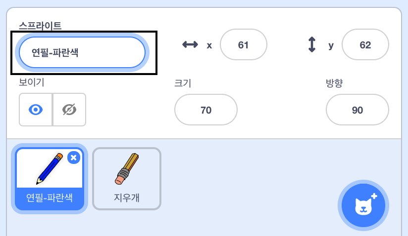
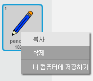
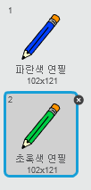
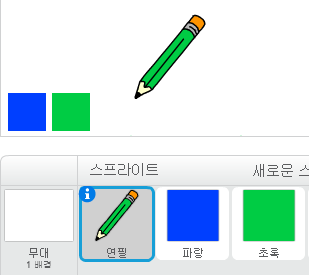

## 색연필

다양한 색깔의 연필들을 추가해서 다양한 색의 선을 그릴 수 있도록 해 봅시다.

\--- task \---

Click on the Costumes tab of the 'pencil' sprite.

Rename the `pencil-a` costume to `pencil-blue`



\--- /task \---

\--- task \---

Right click on the pencil-blue costume and select **duplicate**.



\--- /task \---

\--- task \---

Name the new costume 'pencil-green', and colour the pencil green.



\--- /task \---

\--- task \---

Draw two new sprites: one blue square and one green square. These are for choosing between the blue and green pencil.



\--- /task \---

\--- task \---

Rename the new sprites so that they are called 'blue' and 'green'

[[[generic-scratch3-rename-sprite]]]

\--- /task \---

\--- task \---

Add some code to the 'green' sprite so that when this sprite is clicked, it `broadcasts`{:class="block3events"} the message "green".


```blocks3
이 스프라이트가 클릭될 때
(green v) 브로드캐스트
```

[[[generic-scratch3-broadcast-message]]]

\--- /task \---

The pencil sprite should listen for the "green" message and change its costume and pencil colour in response.

\--- task \---

Switch to your pencil sprite. Add some code so that when this sprite receives the `green`{:class="block3events"} broadcast, it switchs to the green pencil costume and changes the pen colour to green.


```blocks3
[green v] 메시지를 받았을 때
모양을 (pencil-green v) 로 바꾸기
펜 색깔을 [#00CC44] 로 바꾸기
```

To set the pencil to colour to green, click the coloured square in the `set pen color`{:class="block3extensions"} block, and then click on the green square sprite.

\--- /task \---

Then to a similar thing so that you can switch the pencil colour to blue.

\--- task \---

Click on the blue square sprite and add this code:


```blocks3
이 스프라이트가 클릭될 때
(파랑 v) 신호보내기
```

Then click on the pencil sprite and add this code:


```blocks3
[파랑 v] 신호를 받았을 때
모양을 (파란색 연필 v) 으로 바꾸기
펜 색깔을 [#0000ff] 로 바꾸기
```

\--- /task \---

\--- task \---

Finally, add this code to tell the pencil sprite which colour to start with, and to make sure that the screen is clear when your program starts.


```blocks3
플래그를 클릭했을 때
+전부 삭제
+모양을 (pencil-blue v) 로 바꾸기
+펜 색깔을 [#0035FF] 로 바꾸기
무한 반복
  (mouse pointer v) 로 이동
만약 <mouse down?> 라면
  펜으로 그리기
  아니면
  펜으로 그리지 않기
끝
```

\--- /task \---

If you prefer, you can start with a different colour pencil.

\--- task \---

Test your code. Can you switch between the blue and green pencil colours by clicking on the blue or green square sprites?


\--- /task \---