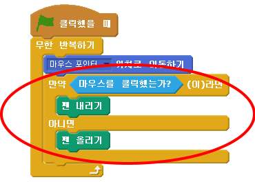

## 연필 만들기

Let's start by making a pencil that can be used to draw on the stage.

+ 'Paintbox' 스크래치 프로젝트를 온라인 [jumpto.cc/paint-go](http://jumpto.cc/paint-go){:target="_blank"} 에서 열거나 <http://jumpto.cc/paint-get>{:target="_black"} 을 다운로드 받아 오프라인 에디터에서 사용할 수 있는 프로젝트를 엽니다.

연필과 지우개 스프라이트를 볼 수 있습니다:


+ 그림을 그릴 수 있도록 연필 스프라이트가 마우스를 `무한반복하기` 로 따라다닐 수 있도록 몇개의 코드를 추가합니다:

```blocks
    when flag clicked
    forever
      go to [mouse pointer v]
    end
```

+ Click the flag and then move the mouse around the stage to test whether the code works.

Next, let's make your pencil only draw `if`{:class="blockcontrol"} the mouse has been clicked.

+ Add this code to your pencil sprite:



+ Test your code again. This time, move the pencil around the stage and hold down the mouse button. Can you draw with your pencil?


## \--- collapse \---

## title: If you're having problems...

If your pencil seems to be drawing the line from the middle of the pencil rather than the tip, you will need to change your costume center.


The crosshair for the pencil must be placed **just below** the tip of the pencil, not on the tip of the pencil.

A changes in a sprite's 'costume center' isn't registered until another tab is clicked, so click on another costume, or on the 'Scripts' tab to finalise your changes to the costume center.

\--- /collapse \---