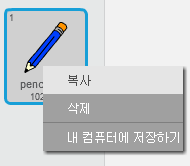
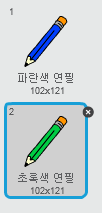
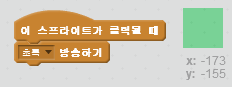

## 색연필

다른 색의 연필들을 추가해서 사용자가 색을 고를 수 있도록 해 봐요.

+ 연필 스프라이트를 클릭하고, '모양' 탭을 누른 후 'pencil-blue' 모양을 복사 해 주세요.



+ 새 모양의 이름을 ’pencil-green’으로 바꾸고, 녹색으로 칠해주세요.



[[[generic-scratch-rename-sprite]]]

+ 새로운 사각형 스프라이트 두 개를 그려주세요. 파란색 하나, 초록색 하나. 어떤 색의 색연필을 사용할 지 선택할 때 이 스프라이트를 사용할 것입니다.


+ Rename your sprites so that they are called 'blue' and 'green'

+ Add some code to the 'green' sprite so that when it is clicked, it will `broadcast`{:class="blockevents"} the message "green" to the pencil sprite, telling it to change its costume and pencil colour.



[[[generic-scratch-broadcast-message]]]

+ Switch to your pencil sprite. Add some code so that when this sprite receives the `broadcast`{:class="blockevents"} green, it should switch to the green pencil costume and change the pen colour to green.


To set the pencil to colour to green, click the coloured box in the `set pen color`{:class="blockpen"} block, and click on the green sprite to choose the same colour green as your pencil colour.

+ You can now do the same for the blue pencil icon: add this code to the blue square sprite:

```blocks
when this sprite clicked
broadcast [blue v]
```

...and add this code to the pencil sprite:

```blocks
when I receive [blue v]
switch costume to [pencil-blue v]
set pen color to [#0000ff]
```

+ Finally, add this code to tell the pencil sprite which colour to start with, and make sure that the screen is clear.


We chose to start with blue but if you prefer, you can start with a different colour pencil.

+ Test out your project. Can you switch between blue and green pens by clicking on the blue or green square sprites?

