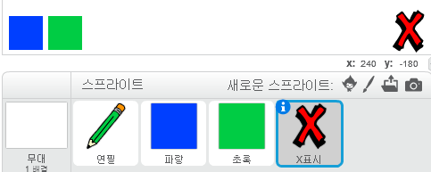
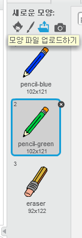

## 실수를 되돌리기

언제든 실수는 할 수 있죠, 그러니 '모두 지우기' 버튼과 지우개를 추가 해 봅시다.

--- task --- 라이브러리의 letters 섹션에서 'X-block'스프라이트를 추가합니다. 스프라이트의 모양에 빨간색을 칠하고 조금 작게 만들어 봅니다. 지금 만든 것은 '모두 지우기' 버튼으로 쓸 것입니다.

[[[generic-scratch3-sprite-from-library]]]

 --- /task ---

--- task --- 'X-block' 스프라이트에 코드를 추가하여 스프라이트가 클릭되었을 때 스테이지를 지우도록 합니다.


```blocks3
이 스프라이트를 클릭했을 때
모두 지우기
```

--- /task ---

`브로드캐스트`{:class="block3events"}를 사용하여 스테이지를 지울 필요가 없습니다. 왜냐하면 `모두 지우기`{:class="block3extensions"} 블록이 브로드캐스트와 동일한 작업을 하기 때문이죠.

연필 스프라이트에 지우개가 함께 있는 것이 보입니까?



프로젝트에는 별도의 지우개 스프라이트가 포함되어 있습니다.

--- task --- 이 지우개 스프라이트를 오른쪽 클릭하고 **보이기**를 클릭하세요. 스테이지가 다음처럼 보여야 합니다:

 --- /task ---

--- task --- 지우개 스프라이트를 클릭하는 경우 `'지우개' 브로드캐스트`{:class="block3events"} 를 전송하도록 코드를 추가하세요.


```blocks3
이 스프라이트를 클릭했을 때
(eraser v) 브로드캐스팅
```

--- /task ---

연필이 "지우개" 메세지를 받으면, 연필의 모양을 지우개로 바꾸고, 연필의 색을 스테이지 색과 같은 흰색으로 바꿔줍시다.

--- task --- 지우개를 만들기 위해 코드 추가해 볼까요.

--- hints ---
 --- hint --- 아래 코드를 연필 스프라이트에 추가하세요. `eraser 신호를 받았을 때`{:class="block3events"} `모양을 지우개로 바꾸기`{:class="block3looks"} `펜 색상을`{:class="block3extensions"} 하얀색으로 설정
--- /hint ---
 --- hint --- 아래와 같은 블록이 필요할 것입니다:

```blocks3
펜 색상을 [#FFFFFF] 로 설정
[eraser v] 신호를 받았을 때

모양을 (eraser v) 로 바꾸기
```

--- /hint --- --- hint --- 아래와 같이 코드를 작성할 수 있습니다. 

```blocks3
[지우개 v] 신호를 받았을 때
모양을 (지우개 v) 로 바꾸기
펜 색깔을 [#FFFFFF] 로 바꾸기
```

--- /hint ------ /hints --- --- /task ---

--- task --- 스테이지를 빈 화면으로 만들 수 있는지 연필로 그린 선을 지울 수 있는지 확인합니다.

 --- /task ---

연필에 관련 된 문제가 하나 더 있어요! 스테이지의 어디든 그릴 수 있기 때문에, '모두 지우기'와 '지우개' 버튼에도 그릴 수가 있는 문제가 있습니다.


--- task --- 이 문제를 해결하려면 마우스를 클릭함과 **동시에** 마우스 포인터 `y`의 위치가 `-120`보다 큰 경우에 선을 그리도록 해야 합니다:


```blocks3
깃발이 클릭되었을 때
모두 지우기
모양을 (pencil-blue v) 로 바꾸기
무한 반복
 (mouse pointer v) 로 이동하기
+만약 <<mouse down?> 과 <(mouse y) > [-120]>> 이라면
  선을 그리기
  아니면
  선을 그리지 않기
끝
```

--- /task ---

--- task --- 다시 테스트 해 보세요. 이제 버튼 근처에선 선을 그릴 수 없어야합니다.

 --- /task ---