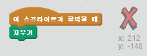
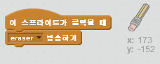
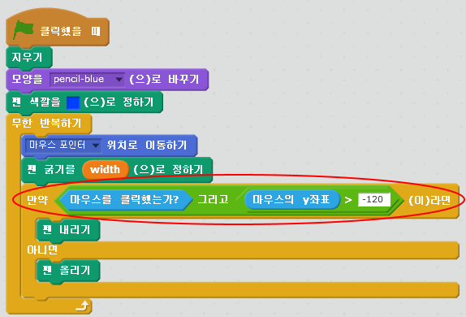

## 실수 해보기

언제든 실수는 할 수 있죠, 그러니 '다 지우기' 버튼과 지우개를 추가 해 봅시다.

+ 'X-block' 스프라이트를 추가하세요. 저장소의 글자들 섹션에서 찾을 수 있습니다. 모양을 빨간색으로 바꿔 주세요. 이게 '다 지우기' 버튼이 될 것입니다.


+ 이 버튼을 누르면 스테이지를 전부 지우도록 코드를 추가 해 봅시다.



스테이지를 지우기 위해 메세지를 보낼 필요는 없어요. 그냥 '지우기' 블럭을 사용하면 됩니다.

아마도 연필 스프라이트가 지우개 모양을 포함하고 있음을 눈치 챘을거에요.


+ Your project also includes a separate eraser sprite. Right click on this sprite and choose 'show'. Here is how your stage should look:


+ 지우개 스프라이트가 클릭되면 연필이 지우개로 바뀔 수 있도록 코드를 추가합시다.



연필이 "지우개" 메세지를 받으면, 연필의 모양을 지우개로 바꾸고, 연필의 색을 스테이지 색과 똑같이 흰색으로 바꿔줍시다.

+ 지우개를 만들기 위해 몇가지 코드 추가하기

\--- hints \--- \--- hint \--- Add some code to the pencil sprite: **When I receive** the **eraser** message **Switch to costume** eraser **Set pen color** to white \--- /hint \--- \--- hint \--- Here is how the code inside the pencil sprite should look:

```blocks
when I receive [eraser v]
switch costume to [eraser v]
set pen color to [#FFFFFF]
```

\--- /hint \--- \--- /hints \---

+ '다 지우기'와 지우개가 잘 동작하는지 프로젝트를 테스트 해 봅시다.


연필에 관련 된 문제가 하나 더 있어요! 스테이지의 어디든 그릴 수 있기 때문에, 색깔 선택 아이콘 근처에도 그릴 수 있습니다.


이걸 해결하려면, 마우스 버튼이 눌려있고, *그리고* 만약 마우스의 y-위치가 -120보다 클 때만 그리도록 하면 됩니다.



+ 프로젝트를 테스트 해 보세요. 이제는 색깔 선택 위치 근처에는 그릴 수 없어야 합니다.

