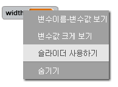
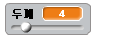

## 펜의 두께 변경하기

이번엔 펜의 두께를 바꾸어 선을 그려 보도록 해 봅시다.

--- task --- 먼저, `두께`{:class="block3variables"}라는 이름의 새 변수를 추가 해 보세요.

[[[generic-scratch3-add-variable]]] --- /task ---

--- task --- 다음 코드를 `무한반복`{:class="block3control"} 루프 **안쪽**에 넣어주세요:

```blocks3
⚑ 클릭했을 때
모두 지우기
모양을 (pencil-blue v) \(으\)로 바꾸기
펜 색깔을 [#0035FF] \(으\)로 정하기
무한 반복하기 
  (mouse pointer v) \(으\)로 이동하기
+ 펜 굵기를 (두께 :: variables) \(으\)로 정하기
  만약 <<마우스를 클릭했는가?> 그리고 <(마우스의 y좌표) > [-120]>> \(이\)라면 
    펜 내리기
  아니면 
    펜 올리기
  end
end
```

--- /task ---

이제 펜 너비가 `두께`{:class="block3variables"} 값으로 설정됩니다. 

--- task --- 스테이지의 표시된 변수값`두께`{:class="block3variables"} 를 우클릭 한후, **슬라이더**를 클릭하세요.

 --- /task ---

슬라이더를 드래그 해서 변수의 값을 바꿀 수 있습니다.



--- task --- 펜의 두께를 조정할 수 있는지 확인하십시오.

 --- /task ---
