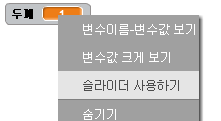

## Change the pen width

Next you will add code to allow the person using your program to draw things with different pen widths.

\--- task \--- First, add a new variable called `width`{:class="block3variables"}.

[[[generic-scratch3-add-variable]]] \--- /task \---

\--- task \--- Add this line **inside** the `forever`{:class="block3control"} loop of the pencil sprite's code:

```blocks3
when flag clicked
erase all
switch costume to (pencil-blue v)
set pen color to [#0035FF]
forever
go to (mouse pointer v)
+set pen size to (width :: variables)
if <<mouse down?> and <(mouse y) > [-120]>> then 
  pen down
  else
  pen up
end
```

\--- /task \---

The pen width now repeatedly gets set to the value of the `width`{:class="block3variables"} variable.

\--- task \--- Right-click on the `width`{:class="block3variables"} variable displayed on the Stage, and then click on **slider**.

 \--- /task \---

You can now drag the slider that is visible below the variable to change the variable's value.


\--- task \--- Test your project and see if you can add code to adjust the pen width.

 \--- /task \---