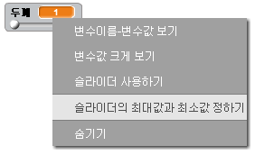

## 연필 두께 변경하기

다양한 범위의 연필 두께로 그림을 그릴 수 있도록 해 봐요.

+ 먼저, `width`{:class="blockvariable"}라는 이름의 새 변수를 추가 해 보세요.

[[[generic-scratch-add-variable]]]

+ 이 코드를 연필코드의 `무한반복하기` 루프 *안쪽*에 넣어주세요:

```blocks
    펜 굵기를 (width)로 정하기
```

이제 연필의 두께는 'width' 변수의 값으로 맞춰질 것입니다.

+ 스테이지 위의 변수 표시창을 우클릭 해서 '슬라이더 사용하기' 를 눌러 보세요.


변수 아래의 슬라이더를 드래그 해서 변수의 값을 바꿀 수 있습니다.


+ 프로젝트를 테스트 해 보고, 연필의 두께를 바꿀 수 있는지 확인 해 보세요.


원한다면, 'width'의 최소값과 최대값을 정해 둘 수 있습니다. To do this, right-click on the variable again and click 'set slider min and max'. Set the minimum and maximum values of your variable to something more sensible, like 1 and 20.



맘에 들 때 까지 'width' 변수의 테스트를 해 보세요.