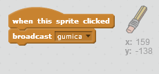

## Greške

Ponekad se dešavaju greške, pa ćemo u tvoj projekat dodati dugme 'obriši' i gumicu.

+ Dodaj lik 'X-block' - naći češ ga u biblioteci (library), u odjeljku Slova (letters). Oboji kostim u crveno. To će biti dugme 'obriši'.


+ Dodaj kôd ovom liku da očisti pozornicu kada se na njega klikne.


Primijeti da nije potrebno slati poruku za čišćenje pozornice, pošto možeš da koristiš blok očisti (clear) ovog lika.

Vjerovatno primjećuješ da tvoj lik olovke ima kostim gumice:


+ Tvoj projekat takođe ima poseban lik gumice. Klikni desnim tasterom miša na njega i izaberi 'show' (prikaži). Tvoja pozornica bi trebalo da izgleda ovako:


+ Dodaj kôd liku gumice koji će olovci reći da se zamijeni sa gumicom kada se klikne na lik.



Kada olovka dobije poruku "gumica", možeš kostim olovke zamijeniti kostimom gumice, a boju olovke promijeniti u bijelu - boju jednaku boji pozornice!

+ Dodaj kôd za keiranje gumice

\--- hints \--- \--- hint \--- Add some code to the pencil sprite: **When I receive** the **eraser** message **Switch to costume** eraser **Set pen color** to white \--- /hint \--- \--- hint \--- Here is how the code inside the pencil sprite should look:

```blocks
when I receive [eraser v]
switch costume to [eraser v]
set pen color to [#FFFFFF]
```

\--- /hint \--- \--- /hints \---

+ Test your project, to see if you can clear and erase on the stage.


There's one more problem with the pencil - you can draw anywhere on the stage, including near the selector icons!


To fix this, tell the pencil only to draw if the mouse is clicked *and* if the y-position of the mouse is greater than -120:


+ Test your project; you now shouldn't be able to draw near the selector blocks.

