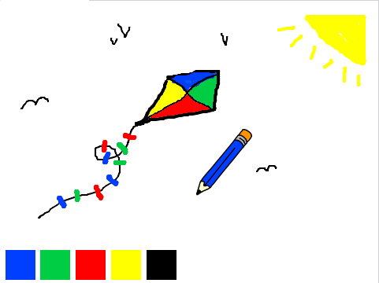

## परिचय

आपले स्वत: चे पेन्ट प्रोग्राम बनवा!

### आपण काय करीन

प्रारंभ करण्यासाठी हिरव्या ध्वजवर क्लिक करा पेन्सिल हलवण्यासाठी माउस वापरा आणि माउस चे डावे बटण दाबून ठेवा. पेन्सिल बदलण्यासाठी रंग वर क्लिक करा किंवा रबर क्लिक करा आणि आपले कार्य मिटविण्यासाठी त्याचा वापर करा पृष्ठ साफ करण्यासाठी क्रॉस क्लिक करा

  <iframe allowtransparency="true" width="485" height="402" src="https://scratch.mit.edu/projects/embed/63473366/?autostart=false" frameborder="0"></iframe>
  

### आपण काय शिकू

हा प्रकल्प [रास्पबेरी पी डिजिटल मेकिंग शैक्षणिक](http://rpf.io/curriculum)खालील: खालील strands पासून घटक समाविष्ट करते. {: Target = "_ blank"}:

+ [समस्या सोडवण्यासाठी प्रोग्रामिंगची रचना एकत्र करा.](https://www.raspberrypi.org/curriculum/programming/builder){: लक्ष्य = "_ blank"}

### शिक्षकांसाठी अतिरिक्त माहिती

आपण हा प्रकल्प मुद्रित करण्याची आवश्यकता असल्यास, कृपया [प्रिंटर अनुकूल आवृत्ती](https://projects.raspberrypi.org/en/projects/paint-box/print){: target = "_ blank"} वापरा.

या प्रकल्पासाठी GitHub repo वर प्रवेश करण्यासाठी फूटरमध्ये दुवा वापरा, ज्यात 'एन / संसाधने' फोल्डरमध्ये सर्व संसाधने (उदाहरणार्थ तयार झालेले प्रकल्प समाविष्ट आहे)