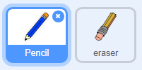

## एक पेन्सिल बनवा

स्टेज वर काढण्यासाठी आपण वापरू शकाल अशी पेन्सिल तयार करा.

\--- task \---

'पेंट बॉक्स' नवशिक्या स्क्रॅच प्रोजेक्ट उघडा.

**ऑनलाइन**: नवशिक्या प्रोजेक्ट ईथे उघडा[rpf.io/paint-box-on](http://rpf.io/paint-box-on){:target="_blank"}

आपल्याकडे स्क्रॅच खाते असल्यास आपण ** Remix** वर क्लिक करून एक प्रत बनवू शकता.

** ऑफलाइन **: [ नवशिक्या प्रोजेक्ट ](http://rpf.io/p/en/paint-box-go){:target="_blank"} उघडा ऑफलाइन संपादकात.

आपल्याला स्क्रॅच ऑफलाइन संपादक डाउनलोड आणि स्थापित करणे आवश्यक असल्यास, आपण ते [ rpf.io/scratchoff येथे शोधू शकता ](http://rpf.io/scratchoff) {:target = "_ blank"}

नवशिक्या प्रोजेक्टमध्ये आपणास पेन्सिल आणि खोडरबर स्प्राइट्स दिसायला पाहिजेत:



\--- /task \---

\--- task \---

आपल्या प्रोजेक्ट मघे पेन इक्स्टेन्शन जोडा.

[[[generic-scratch3-add-pen-extension]]]

\--- /task \---

\--- task \---

पेन्सिल स्प्राइटमध्ये असा कोड जोडा जेणेकरून स्प्राइट माउस पॉईंटरचे अनुसरण ` कायमचे ` {:class= "block3control"} करून आपण चित्र बनवू शकाल:


```blocks3
when flag clicked
forever
  go to (mouse pointer v)
end
```

\--- /task \---

\--- task \---

आपला कोड काम करतो की नाही हे तपासण्यासाठी ध्वजांकनावर क्लिक करा आणि नंतर माउस पॉईंटरला हलवा.

\--- /task \---

पुढे, आपली पेन्सिल फक्त `if`{:class="block3control"} माउस बटण क्लिक केलेले असल्यास वापरा.

\--- task \---

आपल्या पेन्सिल स्प्राईटमध्ये हा कोड जोडा:


```blocks3
when flag clicked
forever
  go to (mouse pointer v)

+ if <mouse down?> then
  pen down
  else
  pen up
end
```

\--- /task \---

\--- task \---

आपल्या कोडची पुन्हा चाचणी घ्या. यावेळी स्टेजच्या भोवती पेन्सिल हलवा आणि माउस बटण दाबून ठेवा. आपण आपल्या पेन्सिलने चित्र काढू शकता?


\--- /task \---

## \--- collapse \---

## शीर्षक: आपली पेन्सिल टिप पासून चित्र काढत नाही?

जर आपली पेन्सिल रेखा लाइन पेन्सिलच्या मध्यभागी येत असल्यासारखी दिसत असेल तर आपल्याला आपला पेन्सिल स्प्राइट बदलणे आवश्यक आहे जेणेकरून टीप हे स्प्राइटचे केंद्र आहे.

पेन्सिल स्प्राइटवर क्लिक करा आणि नंतर **Costumes** अर्थात पोशाख टॅब वर क्लिक करा.

Costume अर्थात पोशाख हलवा जेणेकरून पेन्सिलची टीप **अगदी ** मध्यबिंदू वर आहे.


आता पेन्सिल सगळिकडे हलवा आणि चित्र काढा. पेन्सिलने आता त्याच्या टीपवरून एक रेषा काढावी.

\--- /collapse \---