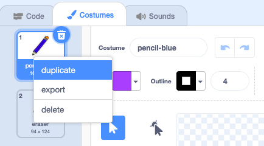

## रंगीत पेन्सिल

आता आपण आपल्या प्रोजेक्टमध्ये भिन्न रंगीत पेन्सिल जोडणार आहोत आणि त्या निवडण्याची परवानगी देणार आहोत.

\--- task \---

पेन्सिल स्प्राईटच्या कॉस्ट्यूम्स टॅबवर क्लिक करा.

`पेन्सिल-a` स्प्राइटचे नाव`पेन्सिल -निळा`मघ्ये बदला


\--- /task \---

\--- task \---

पेन्सिल-निळ्या पोशाख वर राइट क्लिक करा आणि **डुप्लिकेट**निवडा.



\--- /task \---

\--- task \---

'पेन्सिल-ग्रीन' या नवीन पोशाखाचे नाव द्या आणि पेन्सिल हिरव्या रंगात घाला.


\--- /task \---

\--- task \---

दोन नवीन स्प्राइट्स काढा: एक निळा चौरस आणि एक हिरवा चौरस. हे निळे आणि हिरव्या पेन्सिल दरम्यान निवडण्यासाठी आहेत.


\--- /task \---

\--- task \---

नवीन स्प्रीट्सचे नाव बदला जेणेकरुन त्यांना 'निळा' आणि 'हिरवा' म्हटले जाईल.

[[[generic-scratch3-rename-sprite]]]

\--- /task \---

\--- task \---

ग्रीन स्प्राइटमध्ये काही कोड जोडा जेणेकरून जेव्हा हा स्प्राइट क्लिक केला जाईल तेव्हा तो ` प्रसारित करेल ` {:class="block3events"} संदेश "हिरवा".


```blocks3
when this sprite clicked
broadcast (green v)
```

[[[generic-scratch3-broadcast-message]]]

\--- /task \---

पेन्सिल स्प्राईटने "हिरवा" संदेश ऐकला पाहिजे आणि प्रतिसादात त्याचे costume अर्थात पोशाख आणि पेन्सिलचा रंग बदलला पाहिजे.

\--- task \---

आपल्या पेन्सिल स्प्राइटवर स्विच करा. काही कोड जोडा जेणेकरून जेव्हा या स्प्राइटला `हिरवा`{:class="block3events"} प्रसारित होइल, ती पेन्सिल पोशाख आणि पेनचा रंग हिरव्यामध्ये बदलते.


```blocks3
when I receive [green v]
switch costume to (pencil-green v)
set pen color to [#00CC44]
```

पेन्सिलला हिरव्या रंगात सेट करण्यासाठी, ` पेन कलर सेट करा `{:class="block3extensions"} ब्लॉकमधील रंगीत चौरसवर क्लिक करा आणि नंतर ग्रीन स्क्वेअर स्प्राइटवर क्लिक करा.

\--- /task \---

मग समान गोष्ट म्हणजे आपण पेन्सिलचा रंग निळ्यामध्ये बदलू शकता.

\--- task \---

निळ्या स्क्वेअर स्प्राइटवर क्लिक करा आणि हा कोड जोडा:


```blocks3
when this sprite clicked
broadcast (blue v)
```

नंतर पेन्सिल स्प्राइटवर क्लिक करा आणि हा कोड जोडा:


```blocks3
when I receive [blue v]
switch costume to (pencil-blue v)
set pen color to [#0000ff]
```

\--- /task \---

\--- task \---

शेवटी, कोणत्या रंगापासून पेन्सिल स्प्राइट सुरू करायचा हे सांगण्यासाठी आणि आपला प्रोग्राम सुरू झाल्यावर स्क्रीन स्वच्छ असल्याचे सुनिश्चित करण्यासाठी हा कोड जोडा.


```blocks3
when flag clicked
+erase all
+switch costume to (pencil-blue v)
+set pen color to [#0035FF]
forever
  go to (mouse pointer v)
if <mouse down?> then
  pen down
  else
  pen up
end
```

\--- /task \---

आपण प्राधान्य दिल्यास, आपण भिन्न रंगाच्या पेन्सिलने प्रारंभ करू शकता.

\--- task \---

आपल्या कोडची चाचणी घ्या. आपण निळ्या किंवा हिरव्या रंगाच्या पेन्सिल रंगांमध्ये, निळ्या किंवा हिरव्या चौरस स्प्राइट्सवर क्लिक करुन स्विच करू शकता?


\--- /task \---