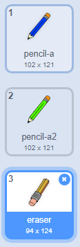

## चुका मीटवा

कधीकधी चुका होत असतात, म्हणून 'clear' अर्थात स्पष्ट आणि erase अर्थात खोडरबर बटण जोडा.

--- task ---

Letters library अर्थात अक्षरे विभागातील 'X-block' स्प्राइट जोडा. स्प्राइटचा पोशाख लाल रंगवा आणि ती थोडी लहान करा. ही स्प्राइट 'क्लियर' बटण आहे.

[[[generic-scratch3-sprite-from-library]]]


--- /task ---

--- task ---

जेव्हा स्प्राईट क्लिक केली तेव्हा स्टेज साफ करण्यासाठी 'X-block' स्प्राइटमध्ये कोड जोडा.


```blocks3
when this sprite clicked
erase all
```

--- /task ---

आपल्याला `broadcast`{:class="block3events"} स्टेज साफ करण्यासाठी गरज नाही, कारण `erase all`{:class="block3extensions"} ते कार्य करते.

आपण पाहू शकता का पेन्सिल स्प्राइटमध्ये खोडरबर costume अर्थात पोशाख समाविष्ट आहे?



आपल्या प्रोजेक्टमध्ये एक वेगळा इरेजर स्प्राइट देखील समाविष्ट आहे.

--- task ---

या इरेजर स्प्राइटवर क्लिक करा आणि नंतर **show (शो)** निवडा.


आपले स्टेज आता कसे दिसावे ते येथे आहे:


--- /task ---

--- task ---

इरेजर स्प्राइट क्लिक केल्यावर `'eraser' प्रसारण`{:class="block3events"} पाठविण्यासाठी इरेझर स्प्राइटमध्ये कोड जोडा.


```blocks3
when this sprite clicked
broadcast (eraser v)
```

--- /task ---

जेव्हा पेन्सिल स्प्राईटला 'eraser' (इरेझर) संदेश प्राप्त होतो, तेव्हा त्याने आपली पोशाख इरेजरवर स्विच करावी आणि पेनचा रंग पांढरा असावा, जो स्टेजसारखेच रंग आहे!

--- task ---

इरेजर तयार करण्यासाठी काही कोड जोडा.

--- hints ---
 --- hint ---

पेन्सिल स्प्राईटमध्ये काही कोड जोडा: `जेव्हा मला (When I receive)`{:class="block3events"} `इरेजर (eraser)`{:class="block3events"} संदेश मिळेल तेव्हा `कॉस्ट्यूम इरेज़र वर स्विच करा (Switch to costume eraser)`{:class="block3looks"} आणि `पेन कलर (Set pen color)`{:class="block3extensions"} पांढर्‍यावर सेट करा

--- /hint --- --- hint ---

आपल्याला आवश्यक असलेले ब्लॉक येथे आहेत:

```blocks3
set pen color to [#FFFFFF]
when I receive [eraser v]

switch costume to (eraser v)
```

--- /hint --- --- hint ---

कोड असा दिसला पाहिजे:


```blocks3
when I receive [eraser v]
switch costume to (eraser v)
set pen color to [#FFFFFF]
```

--- /hint ------ /hints --- --- /task ---

--- task ---

आपण स्टेज साफ करू आणि पेन्सिल लाइन मिटवू शकता की नाही हे पाहण्यासाठी आपल्या प्रोजेक्टची चाचणी घ्या.


--- /task ---

पेन्सिलमध्ये आणखी एक समस्या आहेः 'क्लियर' आणि इरेझर बटणाजवळ आपण स्टेजवर कुठेही ड्रॉ करू शकता!


--- task ---

याचे निराकरण करण्यासाठी, कोड बदला जेणेकरून पेन खाली असेल जर माउस क्लिक केले असेल **आणी** `y` माउस पॉईंटरची स्थिती `-120` पेक्षा मोठी असेल:


```blocks3
when flag clicked
erase all
switch costume to (pencil-blue v)
set pen color to [#0035FF]
forever
  go to (mouse pointer v)
+if <<mouse down?> and <(mouse y) > [-120]>> then 
  pen down
  else
  pen up
end
```

--- /task ---

--- task ---

आपल्या प्रोजेक्टची चाचणी घ्या. आपण आता बटणांण जवळ चित्र नाही काढु शकणार.


--- /task ---